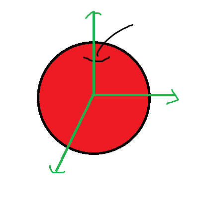
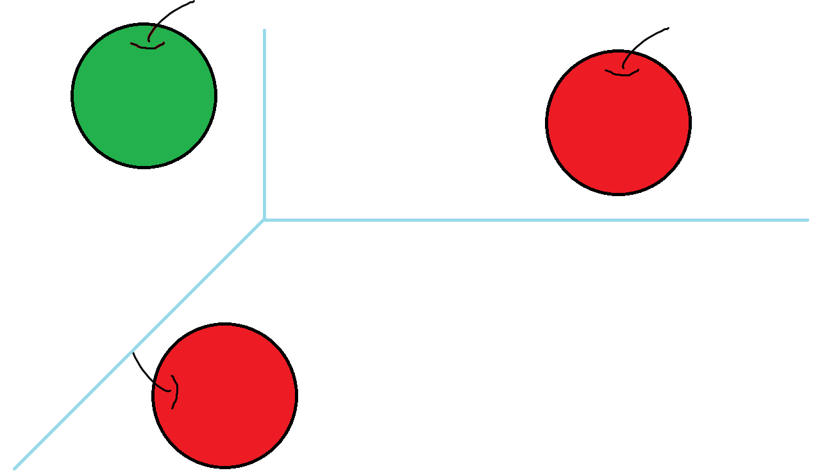
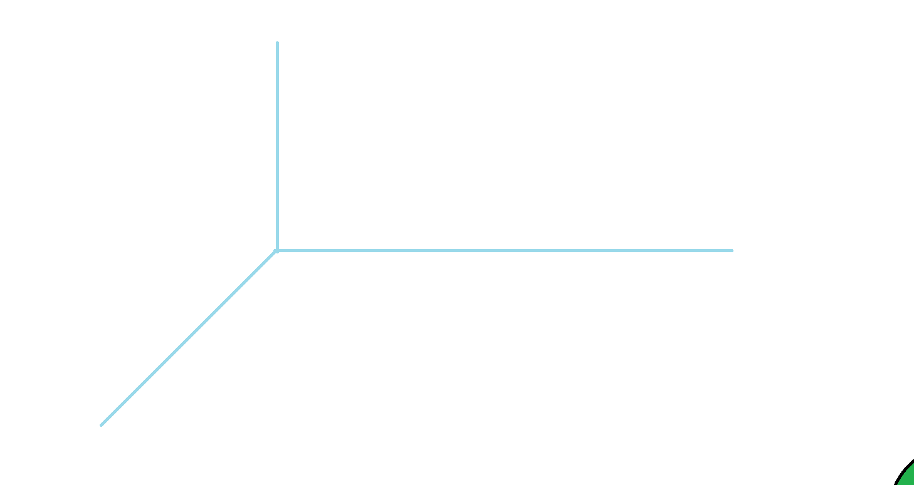
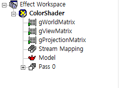
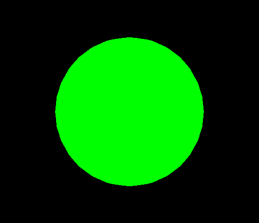

[책 셰이더 프로그래밍 입문 (저자 : Pope Kim)](https://www.hanbit.co.kr/store/books/look.php?p_code=B8421024205)을 보면서 작성했습니다.  

기본적인 색상만 출력하는 셰이더를 만들어보자

# 정점셰이더(VertexShader)
## 입력 데이터
일단 정점셰이더는 전에 말했듯이 3D좌표에서 화면좌표로 변경해주는 것을 해준다.  
따라서 일단 입력받을 데이터 구조체를 만들자

```
struct VS_INPUT
{
   float4 mPosition : POSITION;
};
```
이 변수가 DirectX의 정점버퍼로부터 위치정보를 구해올 수 있는 이유는 POSITION이라는 시맨틱 덕분이다.  
정점버퍼에는 정점의 위치, UV 좌표, 법선 등을 비롯한 다양한 정보가 담겨있을 수 있는데, 이 중에서 필요한 정보만을 쏙속 빼오는 것을 시맨틱이라고 한다.  

따라서 위에 있는 구조체는 정점데이터에서 POSITION정보를 가져와 mPosition에 대입하라 라는 명령이다.

## 출력 데이터
이제 입력 데이터에서 받은 데이터를 내보내 주기 위한 출력 데이터를 살펴보자
```
struct VS_OUTPUT
{
   float4 mPosition : POSITION;
};
```
위에 입력 데이터에서 말한 내용과 비슷하다.

## 3D 공간변환
정점셰이더가 화면좌표로 변환 할때 어떻게 변환을 해줄까??

### 물체공간
각 물체는 물체마다 각각의 좌표를 갖고있다.



### 월드공간

그리고 다른 물체들이 있을 경우 이 물체들을 통일적으로 처리하고 싶다면 어떻게 해야 할까?  
큰 공간을 만들어 각각 물체를 넣어주면 된다.



### 뷰공간
위 두 물체들이 사진 속에 들오도록 사진을 찍고 다음에는 약간 보이는 이상한 곳을 찍어보자. 두 사진은 완전히 다르다. 월드 공간에서는 두 물체의 위치가 전혀 바뀌지 않았지만, 카메라 상에는 안보일 정도로 많이 바뀌었다.

  

이렇게 카메라가 사용하는 공간을 뷰공간이라고 부른다. 뷰공간의 원점은 카메라 렌즈의 정 중앙이고, 역시 그로부터 오른쪽 위쪽 앞쪽으로 3개의 축을 만들 수 있다.

### 투영공간
일반 카메라로 사진을 찰영하면 인간의 눈을 통해 보는것ㄱ과 동일하게 멀리 있는 물체는 작게 보인다. 이유는 인간의 시야가 좌우로 100도정도, 상하로 75도정도로 되어있기 때문(와 이건 진짜 몰랐다...)이다. 따라서 멀리 바라볼 수록 눈에 들어오는 범위가 넓어지는데, 이 늘어난 범위를 일정한 크기로 망막에 담으려다보니 멀리 있는 물체가 작게 보이는것이다.  

따라서 뷰공간에서 만들어진 좌표를 카메라 공간으로 이동, 회전, 확대/축소 시키고, 새로운 공간에 위치된 물체들을 2D 이미지 위에 투영하는 것이다.

## 렌더몽키
위에 설명한 대로 월드, 뷰, 프로젝션 행렬을 갖고와야 한다.



각각 월드 뷰 프로젝션 행렬로 설정해주고, 
```
float4x4 gWorldMatrix;
float4x4 gViewMatrix;
float4x4 gProjectionMatrix;

VS_OUTPUT vs_main(VS_INPUT Input)
{
   VS_OUTPUT Output;
   
   Output.mPosition = mul(Input.mPosition, gWorldMatrix);
   Output.mPosition = mul(Output.mPosition, gViewMatrix);
   Output.mPosition = mul(Output.mPosition, gProjectionMatrix);
   
   return Output;
} 
```

<details>
<summary style="color:green">정점셰이더 전체소스</summary>
<div markdown="1">

```
struct VS_INPUT
{
   float4 mPosition : POSITION;
};

struct VS_OUTPUT
{
   float4 mPosition : POSITION;
};

float4x4 gWorldMatrix;
float4x4 gViewMatrix;
float4x4 gProjectionMatrix;

VS_OUTPUT vs_main(VS_INPUT Input)
{
   VS_OUTPUT Output;
   
   Output.mPosition = mul(Input.mPosition, gWorldMatrix);
   Output.mPosition = mul(Output.mPosition, gViewMatrix);
   Output.mPosition = mul(Output.mPosition, gProjectionMatrix);
   
   return Output;
} 
```

</div>
</details>

이렇게 값을 내보내준다.

# 픽셀셰이더(PixelShader)
## 색의 표현방법
RGBA로 색을 표현하지만 0~255가 아닌 0~1(백분률)로 표현한다.
```
float4 ps_main() : COLOR0
{   
   return( float4( 0.0f, 1.0f, 0.0f, 1.0f ) );   
}
```
끝이다 간단하다.  
이렇게 하고 컴파일을 하면



이제 어느정도 알겠다.