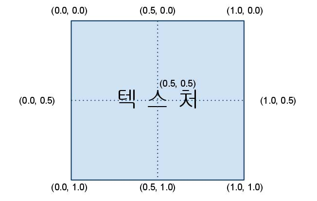
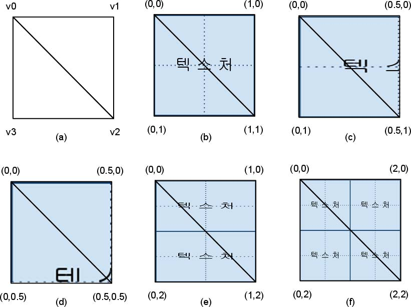
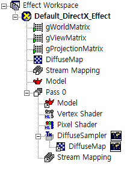
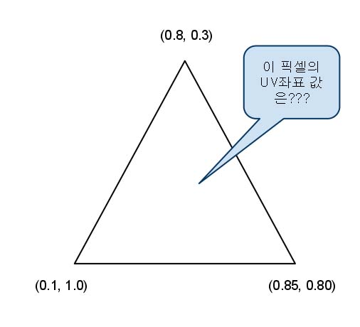
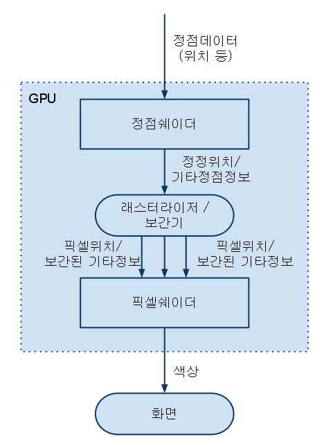
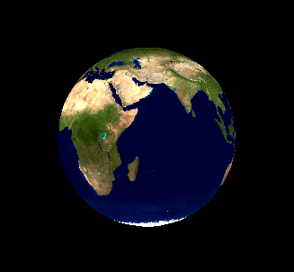

[책 셰이더 프로그래밍 입문 (저자 : Pope Kim)](https://www.hanbit.co.kr/store/books/look.php?p_code=B8421024205)을 보면서 작성했습니다.  

# 텍스처매핑과 UV 좌표
모델을 보면 색으로 채워진 것도 있지만, 텍스처를 매핑해놓은 것도 있다.  
이 전에 모델은 삼각형으로 만든다고 했는데, 삼각형에 어떻게 텍스처를 입힐까?

만약 픽셀을 대응시키면 되긴 한다. 하지만, 문제가 생긴다. 만약 x = 30, y = 101 에 있는 픽셀에 대응시켰을 때, 이 텍스처를 2배로 늘린다면, 안에 있는 값이 변경이 된다.

다른 방법은 모든 값을 백분률로 표현하면 된다.

  

[출처](https://vsts2010.tistory.com/645)

텍스처 매핑을 사용할 때는 UV를 사용한다.  
만역 여기서 UV좌표를 대입하면 어떻게 달라질까

  

[출처](https://vsts2010.tistory.com/645)  
- (a) 아직 텍스처를 입히지 않는 두 삼각형. v0, v1, v2와 v0, v2, v3이 각각 삼각형을 이루고 있다.  
- (b) UV좌표의 범위가 (0,0)~(1,1)이다. 텍스처를 전부 다 보여준다.
- (c) UV좌표의 범위가 (0,0) ~ (0.5,1)이다. 따라서 텍스처의 절반만 보여준다.
- (d) UV좌표의 범위가 (0,0) ~ (0.5,0.5)이다. 따라서 이미지의 왼쪽 절반과 위쪽 절반만을 보여줍니다.
- (e) UV좌표의 범위가 (0,0) ~ (1,2)이다. 텍스처를 위아래로 두 번 반복한다.
- (d) UV좌표의 범위가 (0,0) ~ (2,2)이다. 텍스처를 위아래로 두번, 그리고 좌우로 두 번 반복한다.

# Shader

  

이런식으로 렌더 몽키를 설정해준다.  

## VertexShader
```
struct VS_INPUT
{
   float4 mPosition : POSITION;
   float2 mTexCoord : TEXCOORD0;
};

struct VS_OUTPUT
{
   float4 mPosition : POSITION;
   float2 mTexCoord : TEXCOORD0;
};

float4x4 gWorldMatrix;
float4x4 gViewMatrix;
float4x4 gProjectionMatrix;

VS_OUTPUT vs_main(VS_INPUT Input)
{
   VS_OUTPUT Output;
   
   Output.mPosition = mul(Input.mPosition, gWorldMatrix);
   Output.mPosition = mul(Output.mPosition, gViewMatrix);
   Output.mPosition = mul(Output.mPosition, gProjectionMatrix);
   
   Output.mTexCoord = Input.mTexCoord;
   
   return Output;
}
```

이 전에 색상 셰이더에서 텍스쳐 넘겨준 것만 추가해준다.

### UV
 
정점 셰이더에서 각 부분의 값들(코드 상에서는 구조체) 를 받은 뒤, 전체 픽셀의 값을 보간해서 각 픽셀의 위치를 계산해준다.  

 

그래서 이런 식으로 화면에 출력이 된다.

## PixelShader

```
sampler2D DiffuseSampler;

struct PS_INPUT
{
   float2 mTexCoord : TEXCOORD0;
};

float4 ps_main( PS_INPUT Input ) : COLOR
{
   float4 albedo = tex2D(DiffuseSampler, Input.mTexCoord);
   return albedo.rgba;
}
```
값을 받아서 출력만 해주면 된다.

그러면 

 

이런 식으로 출력이 된다.