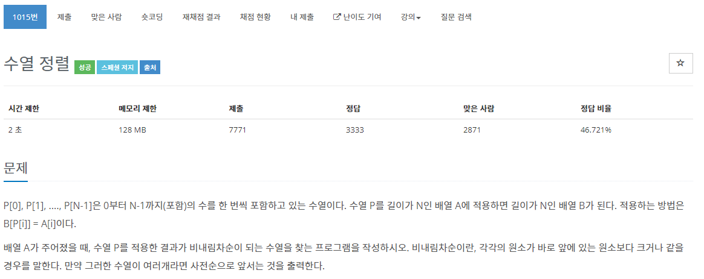

[문제](https://www.acmicpc.net/problem/1015)

이게 뭔말인지 싶었던 문제이다. 생각해보면 간단하다.  
처음에 주어진 숫자들을 정렬하고 그 인덱스 위치를 출력하면 된다.

```
#include <iostream>
#include <algorithm>
#include <vector>

using namespace std;

bool Compare(const int& lValue, const int& rValue)
{
	return lValue < rValue;
}

int main()
{
	int N;
	cin >> N;
	vector<int> v(N);
	vector<int> sorted(N);
	vector<bool> bIsSelected(N, false);

	for(int i = 0 ; i < N ; i++)
	{
		cin >> v[i];
		sorted[i] = v[i];
	}

	sort(sorted.begin(), sorted.end(), Compare);
	vector<int> answer;

	for(int i = 0 ; i < N ; i ++)
	{
		for(int j = 0 ; j < N ; j++)
		{
			if(v[i] == sorted[j])
			{
				if(bIsSelected[j] == false)
				{
					answer.emplace_back(j);
					bIsSelected[j] = true;
					break;
				}
			}
		}
	}
	answer.shrink_to_fit();

	for(int i = 0 ; i < N ; i++)
	{
		cout << answer[i] << " ";
	}
}
```