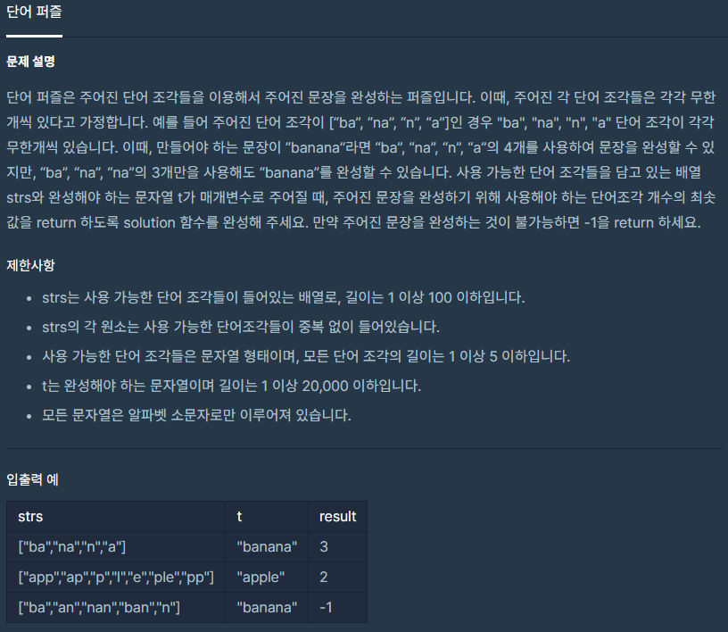

[문제](https://programmers.co.kr/learn/courses/30/lessons/12983)

저번에 코딩테스트를 봤던 회사에서 문제로 나왔던 문제이다.  
이게 문자열 보자마자 아 이건 DP로 풀어야 한다! 라고 생각했는데 어려워서 못풀고 DFS로 풀어서 제출했었다. 그리고 몇일동안 매달린 결과! 답을 보고 이해했다.(데헷)  

처음의 주어진 t 만큼 배열을 만들고 각각의 문자마다 최소로 사용해서 만드는 횟수를 저장해서 DP로 풀면 된다.

```
		a	p	p	l	e
app		1	1	1	99	99
ap		1	1	1	99	99
p		1	1	1	99	99
l		1	1	1	2	99
e		1	1	1	2	3
ple		1	1	2	2	2
pp		1	1	2	2	2
```

이런식이다.(이렇게 복잡하니까 못풀었지 ㅠㅠ)

```
#include <iostream>
#include <string>
#include <vector>
using namespace std;

constexpr int MAX = 99999999;

int solution(vector<string> v, string s)
{
    vector<int> count(s.length(), MAX);

	for(int i = 0 ; i < s.length() ;i++)
	{
		int index = i;
		char c = s[i];
		for(int j = 0 ; j < v.size(); j++)
		{
			bool bIsSame = true;
			int length = v[j].length() - 1;
			if(v[j][length] == c)
			{
				for(int k = 0 ; k <= length; k++)
				{
					if(s[index - k] != v[j][length - k])
					{
						bIsSame = false;
						break;
					}
				}
				if(bIsSame == true)
				{
					if(index - length == 0)
					{
						count[index] = 1;
					}
					else
					{
						if(count[index - length - 1] + 1 < count[index])
						{
							count[index] = count[index - length - 1] + 1;
						}
					}
				}
			}
		}
	}

	int answer = count[s.length() - 1];
	if (answer >= MAX)
	{
		answer = -1;
	}

	return answer;
}
```

문자열마다 하나씩 순회하면서 값을 체크해준다.