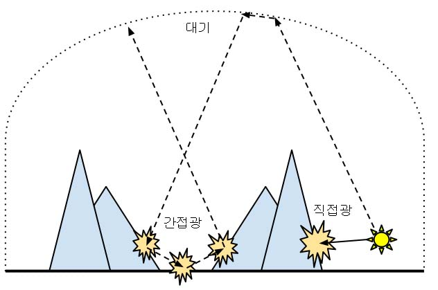
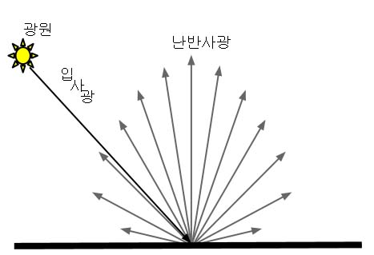
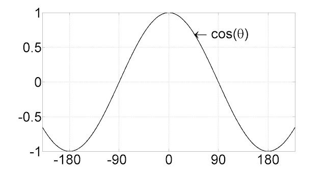
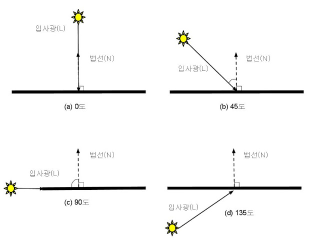
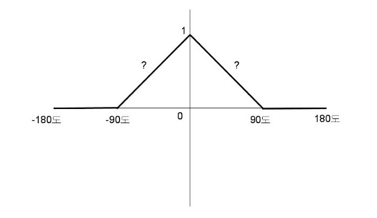
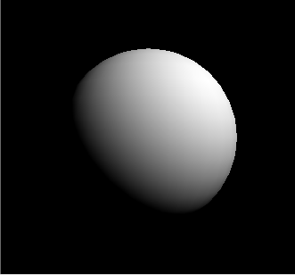

[책 셰이더 프로그래밍 입문 (저자 : Pope Kim)](https://www.hanbit.co.kr/store/books/look.php?p_code=B8421024205)을 보면서 작성했습니다.  

# 직접광
빛이 각 물체에 반사를 하여 우리 눈에 보인다. 이렇게 반사돼서 들어오는 빛을 간접광이라고 한다. 반대라 광원으로부터 직접 받는 빛은 직접광이라고 한다.  

  

[출처](https://kblog.popekim.com/2012/01/04-part-3.html)

간접광과 직접광중에 간접광은 수없이 반사의 반사를 거치므로 직접광보다 계산하기 어렵다. 간접광을 계산하는 방법 중 하나로 RayTracing이 있다.(보고싶은데 글카 가격때문에 보기 힘들다 ㅠㅠ) 하지만, 하드웨어의 한계로 특정 하드웨어에서만 구현이 가능하고, 엄청난 연산량이 필요하다.  
따라서 많은 컴퓨터 게임에서는 직접광만 제대로 계산하고, 간접광은 흉내내기 정도로 그치는게 보통이다.  
빛을 구성하는 요소는 크게 난반사광(Diffuse Light)과 정반사광(Specular Light)이 있다.

## 난반사광 (Diffuse Light)
대부분의 물체는 직접 빛을 발하지 않고, 다른 물체가 발산하는 빛이 이 물체의 표면에서 반사되기 때문이다. 이때, 여러 방향으로 고르게 반사되는 빛이 있는데 이것을 난반사광(Diffuse Light)라고 한다. 따라서 어느 방향에서 바라봐도 물체의 명암이나 색조가 크게 변하지 않는다.

  

[출처](https://kblog.popekim.com/2012/01/04-part-3.html)

이런 식으로 난반사가 나온다. 그럼 이것을 수학적으로 계산해보자  
게임에서 주로 사용하는 방법은 람페르트 모델이다. 표면법선과 입사광을 이루는 각의 코사인 값을 구하면, 그게 바로 난반사광의 양이라고 한다.

 

[출처](https://kblog.popekim.com/2012/01/04-part-3.html)

위 그래프를 보면 입사광 표면 법선의 각도가 0일때 결과가 1이다. 그리고 각도가 늘어날수록 결과가 점점 작아지다가 90도가 되면 0이 된다. 그렇다면 실제로는 어떻게 바뀔까? 

 

[출처](https://kblog.popekim.com/2012/01/04-part-3.html)

여기서 평면이 가장 밝게 빛날때는 언제일까? 당연히, 광원이 중천에 있을때 이다. 그리고 가장 어두울때는 지평을 넘어갔을 때이다.  
이 현상을 그래프로 그리면

 

[출처](https://kblog.popekim.com/2012/01/04-part-3.html)

법선과 광원이 이루는 각도를 X축으로 두고, 표면의 밝기는 Y축으로 한다.  
Y축이 1일때 가장 밝고 0일때 아주 어두울때를 알 수 있다.  
중간에 물음표는 각도가 줄어듦에 따라 얼마나 빠르게 표면이 어두워지는지를 모르기 때문이다.  

그럼 람베르트 모델을 적용하면 코사인 함수 한 번으로 난반사광을 쉽게 구할 수 있습니다. 하지만, 코사인 함수는 값싼 함수가 아니어서 셰이더에서 매번 호출하기 부담스럽다. 따라서 내적으로 코사인 연산을 대신하자

θ = A와 B가 이루는 각도  
|A|  = 방향벡터 A의 길이  
|B|  = 방향벡터 B의 길이  

A ∙ B = cosθ |A||B|  
따라서  
cosθ = (A ∙ B) / (|A||B|)  
여기서 두 벡터의 길이는 1로 만들면 공식을 더 간단히 만들 수 있다.  

cosθ = (A' ∙ B')  
두 벡터가 이루는 각의 코사인 값은 두 벡터의 내적과 같다.  그런데 이렇게 벡터의 길이를 바꿔도 괜찮을까? 난반사광을 계산할 때 두 벡터가 이루는 각이 중요할 뿐 벡터의 길이는 결과에 아무런 영향을 미치지 않다.

그럼 내적이 코사인 함수보다 값싼이유는 뭘까? 벡터 A의 성분을 (a,b,c)로 두고, 벡터 B읜 성분을 (d,e,f)로 두면 두 벡터의 내적을 간단히 구할 수 있다.  
A ∙ B = (a ⅹ d) + (b ⅹ e) + (c ⅹ f)

### 정점 셰이더
<details>
<summary style="color:green">정점셰이더</summary>
<div markdown="1">

```
struct VS_INPUT
{
   float4 mPosition : POSITION;
   float3 mNormal : NORMAL;
};

struct VS_OUTPUT
{ 
   float4 mPosition : POSITION;
   float3 mDiffuse : TEXCOORD1;
   float3 mViewDir : TEXCOORD2;
   float3 mReflection : TEXCOORD3;
};

float4x4 gWorldMatrix;
float4x4 gViewMatrix;
float4x4 gProjectionMatrix;

float4 gWorldLightPosition;
float4 gWorldCameraPosition;

VS_OUTPUT vs_main(VS_INPUT Input)
{
   VS_OUTPUT Output;
   
   Output.mPosition = mul(Input.mPosition, gWorldMatrix);
   
   float3 lightDir = Output.mPosition.xyz - gWorldLightPosition.xyz;
   lightDir = normalize(lightDir);
   
   Output.mPosition = mul(Output.mPosition, gViewMatrix);
   Output.mPosition = mul(Output.mPosition, gProjectionMatrix);
   
   float3 worldNormal = mul(Input.mNormal, (float3x3)gWorldMatrix);
   worldNormal = normalize(worldNormal);
   
   Output.mDiffuse = dot(-lightDir, worldNormal);
   
   return Output;
}
```
</div>
</details>

이 전과 조금 다른것은 광원의 위치가 있다. 그리고 광원으로부터 반사된 빛의 Normal값을 받아오자

입사광벡터를 만들자. 입사광의 벡터는 광원의 위치에서 현재 위치까지 선을 그으면 된다. 여기서 주의할 점은 3D 수학에서 올바른 결과를 얻으려면 모든 변수의 공간이 일치해야 한다. 따라서 월드공간 변환에서 이 연산을 수행해야 한다.  
따라서
```
float3 lightDir = Output.mPosition.xyz - gWorldLightPosition.xyz;
```
이렇게 연산을 해야 한다.  
마지막으로 벡터의 길이를 1로 만들어주는 normalize()함수를 사용해준다.  
```
lightDir = normalize(lightDir);
```
이제 법선을 갖고오자  
```
float3 worldNormal = mul(Input.mNormal, (float3x3)gWorldMatrix);  
worldNormal = normalize(worldNormal);  
```
Input.mNormal이 float3이기 때문에 float3x3로 변환을 해준다. 마지막으로 내적을 구해준다.  
```
Output.mDiffuse = dot(-lightDir, worldNormal);
```
-lightDir을 사용한 이유는 두 벡터의 내적을 구할 때, 화살표의 밑동ㅇ ㅣ서로 만나야 하기 때문이다.

이제 출력 데이터 부분이다.

벡터의 값을 받아올 float3로 받아온다.  
시멘틱은 용도에 딱 맞는 시맨틱이 없는 경우가 있으면 TEXCOORD시맨틱을 사용한다. 최소한 8개의 TEXCOORD가 존재하므로 별로 모자라는 경우가 없다.


### 픽셀 셰이더

내적은 코사인함수에서 나온 값이기 때문에 -1 ~ 1의 값을 갖는다. 난반사광의 범위는 0 ~ 1 사이의 값이기 때문에 -1 이하는 0으로 바꿔준다.  
saturate()함수가 이 기능을 해준다. 성능에 아무런 영향을 미치지 않는 공짜함수이다.

<details>
<summary style="color:green">픽셀셰이더</summary>
<div markdown="1">

```
struct PS_INPUT
{
   float3 mDiffuse : TEXCOORD1;
};

float4 ps_main(PS_INPUT Input) : COLOR
{
   float3 diffuse = saturate(Input.mDiffuse);
   return float4(diffuse, 1);
}

```

</div>
</details>

## 결과

 

무광의 자신의 빛만 반사시키는 물체가 나왔다