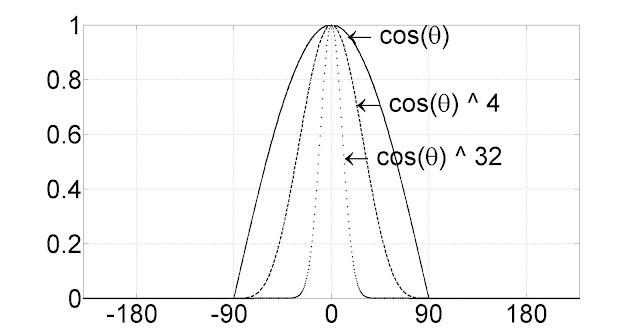
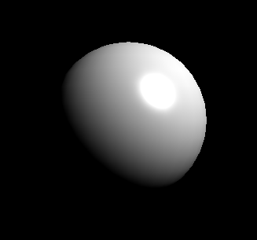

[책 셰이더 프로그래밍 입문 (저자 : Pope Kim)](https://www.hanbit.co.kr/store/books/look.php?p_code=B8421024205)을 보면서 작성했습니다.  

# 정반사광
정반사광은 난반사광과는 달리 한 방향으로만 반사괴는 빛으로 입사각과 출사각과 같은 것이 특징이다. 따라서 정반사광의 효과를 보려면 빛이 반사괴는 방향에서 물체를 바라봐야만 한다.

  

난반사광가 마찬가지로 정반사광을 수학적으로 재현해내는 수학공식이 여러 개 있다. 지금은 퐁 모델을 사용할 예정이다.  
퐁모델은 반사광과 카메라벡터가 이루는 각도의 코사인 값을 구하고, 그 결과를 여러번 거듭제곱하면 정반사광을 구할 수 있다.

  

난반사광을 구하는 방식과 다른게 없는데 왜 거듭제곱을 할까?

  

그래프를 보면 거듭제곱수가 늘어남에 따라 코사인 값이 빠르게 줄어든다.  정반사광의 폭은 난반사광에 비해 상당히 타이트하기 때문에 코사인값에 거듭제곱을 한다.  
거듭제곱 횟수는 보통 20번 하면 괜찮은 결과를 얻을 수 있다.

## 정점 셰이더

<details>
<summary style="color:green">정점셰이더</summary>
<div markdown="1">

```
struct VS_INPUT
{
   float4 mPosition : POSITION;
   float3 mNormal : NORMAL;
};

struct VS_OUTPUT
{ 
   float4 mPosition : POSITION;
   float3 mDiffuse : TEXCOORD1;
   float3 mViewDir : TEXCOORD2;
   float3 mReflection : TEXCOORD3;
};

float4x4 gWorldMatrix;
float4x4 gViewMatrix;
float4x4 gProjectionMatrix;

float4 gWorldLightPosition;
float4 gWorldCameraPosition;

VS_OUTPUT vs_main(VS_INPUT Input)
{
   VS_OUTPUT Output;
   
   Output.mPosition = mul(Input.mPosition, gWorldMatrix);
   
   float3 lightDir = Output.mPosition.xyz - gWorldLightPosition.xyz;
   lightDir = normalize(lightDir);
   
   float3 viewDir = normalize(Output.mPosition.xyz - gWorldCameraPosition.xyz);
   Output.mViewDir = viewDir;
   
   Output.mPosition = mul(Output.mPosition, gViewMatrix);
   Output.mPosition = mul(Output.mPosition, gProjectionMatrix);
   
   float3 worldNormal = mul(Input.mNormal, (float3x3)gWorldMatrix);
   worldNormal = normalize(worldNormal);
   
   Output.mDiffuse = dot(-lightDir, worldNormal);
   Output.mReflection = reflect(lightDir, worldNormal);
   
   return Output;
}
```

</div>
</details>

gWorldCameraPosition을 선언해준다.  

정반사광을 구하려면 코사인 값에 거듭제곱을 해야 하는데 거듭제곱을 한 뒤 보간을 한 결과와 보간을 한 뒤에 겨듭제곱을 한 결과의 차이는 엄청나다. 따라서 정반사광 계산은 픽셀셰이더에서 해야 하므로 두 방향벡터만 구해서 넘겨주자.
```
float3 mViewDir : TEXCOORD2;
float3 mReflection : TEXCOORD3;
```

반사벡터를 구하는 수학 공식은 reflect()함수가 계산해준다.

## 픽셀셰이더
<details>
<summary style="color:green">정점셰이더</summary>
<div markdown="1">

```
struct PS_INPUT
{
   float3 mDiffuse : TEXCOORD1;
   float3 mViewDir : TEXCOORD2;
   float3 mReflection : TEXCOORD3;
};

float4 ps_main(PS_INPUT Input) : COLOR
{
   float3 diffuse = saturate(Input.mDiffuse);
   
   float3 reflection = normalize(Input.mReflection);
   float3 viewDir = normalize(Input.mViewDir);
   float3 specular = 0;
   if(diffuse.x > 0)
   {
      specular = saturate(dot(reflection, -viewDir));
      specular = pow(specular, 20.0f);
   }
   
   float3 ambient = float3(0.1f, 0.1f, 0.1f);
   
   return float4(ambient + diffuse + specular, 1);
}
```

</div>
</details>

우선 정점셰이더의 출력 데이터를 갖고올 두 벡터를 PS_INPUT구조체에 추가한다.
```
float3 mViewDir : TEXCOORD2;
float3 mReflection : TEXCOORD3;
```
우선 mReflection과 mViewDir을 다시 한 번 정규화시켜준다. 다시 정규화 해주는 이유는 보간기를 거치는 동ㄴ안 그 값이 흐트러질 수 있기 때문이다.

```
float3 reflect = normalize(Input.mReflection);
float3 viewDir = normalize(Input.mViewDir);
```
이제 이 두 벡터의 내죽을 구한 뒤, 거듭제곱을 합니다.

```
float3 specular = 0;
if(diffuse.x > 0)
{
   specular = saturate(dot(reflection, -viewDir));
   specular = pow(specular, 20.0f);
}
```

앞에서 난반사광이 존재하지 않는 표면에는 이미 빛이 닿지 않으므로 정반사광이 존재할 수 없어 난반사광의 양이 0% 이상일 때에만 정반사광을 계산한다.  
거듭제곱을 할 때 pow() 함수를 이용했다. 여기서는 20번 했지만, 물체마다 값이 다르기 때문에 float형의 전역변수로 선언하는 것이 더 좋은 방법이다.

## 결과

 

정반사에 대한 결과다.

이 전에 만든 난반사와 합하면

 

난반사와 정반사로 인해 자연스러운 물체가 나왔다.  
하지만, 공의 왼쪽부분이 어두운게 불편하다. 여기에 간단한 주변광을 정의해서 넣어주자.

 

자연스럽다.
