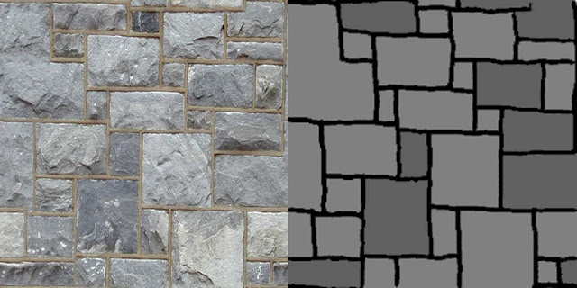
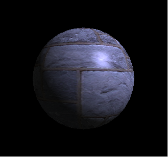

[책 셰이더 프로그래밍 입문 (저자 : Pope Kim)](https://www.hanbit.co.kr/store/books/look.php?p_code=B8421024205)을 보면서 작성했습니다.  

# 디퓨즈/스페큘러매핑
물체가 색을 갖는 이유는 물체마다 흡수/반사하는 빛의 스펙트럼이 다르기 때문이다.  
그렇다면 표면이 빛을 흡수하는 성질을 셰이더에서 어떻게 표현할까 
표면의 색이 한가지라면, 전역변수를 사용해서 구현하면 된다. 하지만 그런 물체는 거의 극소수에 속한다.  

대부분의 물체는 물체의 각 픽셀마다 색상을 정해줘야 한다. 따라서 표면에서 반사할 색을 이미지로 그린 뒤, 픽셀 셰이더에서 이 텍스처를 읽어와 조명계산의 결과에 곱하면 된다.  

이 전에 계산했던 난반사광과 정반사광을 학친 값을 텍스처에 곱해야 할까?  
물체를 지각할 수 있는 대부분의 이유는 난반사광 덕분이다. 따라서 위 텍스처를 난반사광의 결과에만 적용하는 것으로 충분하다. 이것을 디퓨즈맵이라 부른다.

정반사광은 디퓨즈냅으로 사용할 수 있지만, 두가지 이유로 인해 정반사광용으로 스페큘러맵을 따로 만드는 경우가 많다.

1. 난반사광이 반가하는 빛과 정반사광이 반사하는 빛의 스펙트럼이 다른 경우
2. 각 픽셀이 반사하는 정반사광의 정도를 조절하는 용도로 스페큘러맵을 사용할 수도 있다.

매끄러울수록 정반사광이 많이 보인다. 또한, 조명의 색에 의해 바뀐다.

- 난반사광 = 밫의 색상 X 난반사광의 양 X 디퓨즈맵의 값
- 정반사광 = 빛의 색상 X 정반사광의 양 X 스페큘러맵의 값

## 셰이더

 

입혀볼 디퓨즈맵과 스페큘러맵이다.

### 정점셰이더

<details>
<summary style="color:green">정점셰이더</summary>
<div markdown="1">

```
struct VS_INPUT
{
   float4 mPosition : POSITION;
   float3 mNormal : NORMAL;
   float2 mUV : TEXCOORD0;
};

struct VS_OUTPUT
{ 
   float4 mPosition : POSITION;
   float2 mUV : TEXCOORD0;
   float3 mDiffuse : TEXCOORD1;
   float3 mViewDir : TEXCOORD2;
   float3 mReflection : TEXCOORD3;
};

float4x4 gWorldMatrix;
float4x4 gViewMatrix;
float4x4 gProjectionMatrix;

float4 gWorldLightPosition;
float4 gWorldCameraPosition;

VS_OUTPUT vs_main(VS_INPUT Input)
{
   VS_OUTPUT Output;
   
   Output.mPosition = mul(Input.mPosition, gWorldMatrix);
   
   float3 lightDir = Output.mPosition.xyz - gWorldLightPosition.xyz;
   lightDir = normalize(lightDir);
   
   float3 viewDir = normalize(Output.mPosition.xyz - gWorldCameraPosition.xyz);
   Output.mViewDir = viewDir;
   
   Output.mPosition = mul(Output.mPosition, gViewMatrix);
   Output.mPosition = mul(Output.mPosition, gProjectionMatrix);
   
   float3 worldNormal = mul(Input.mNormal, (float3x3)gWorldMatrix);
   worldNormal = normalize(worldNormal);
   
   Output.mDiffuse = dot(-lightDir, worldNormal);
   Output.mReflection = reflect(lightDir, worldNormal);
   
   Output.mUV = Input.mUV;
   
   return Output;
}
```

</div>
</details>

추가된 부분은 UV를 리턴해주는 부분이다.

### 픽셀셰이더

<details>
<summary style="color:green">픽셀셰이더</summary>
<div markdown="1">

```
struct PS_INPUT
{
   float2 mUV : TEXCOORD0;
   float3 mDiffuse : TEXCOORD1;
   float3 mViewDir : TEXCOORD2;
   float3 mReflection : TEXCOORD3;
};

sampler2D DiffuseSampler;
sampler2D SpecularSampler;

float3 gLightColor;

float4 ps_main(PS_INPUT Input) : COLOR
{
   float4 albedo = tex2D(DiffuseSampler, Input.mUV);
   float3 diffuse = gLightColor * albedo.rgb * saturate(Input.mDiffuse); 
   
   float3 reflection = normalize(Input.mReflection);
   float3 viewDir = normalize(Input.mViewDir);
   float3 specular = 0;
   if(diffuse.x > 0)
   {
      specular = saturate(dot(reflection, -viewDir));
      specular = pow(specular, 20.0f);
      
      float4 specularIntensity = tex2D(SpecularSampler, Input.mUV);
      specular *= specularIntensity.rgb * gLightColor;
   }
   
   float3 ambient = float3(0.1f, 0.1f, 0.1f) * albedo;
   
   return float4(ambient + diffuse + specular, 1);
}

```

</div>
</details>

렌더몽키에 추가한 세 변수를 전역으로 선언한다.

```
sampler2D DiffuseSampler;
sampler2D SpecularSampler;

float3 gLightColor;
```

그리고 PS_INPUT 구조체에 UV좌표를 추가한다.

```
float2 mUV : TEXCOORD0;
```

이제 픽셀셰이더 함수의 제일 윗줄에서 디퓨즈맵을 샘플링한다.
```
float4 albedo = tex2D(DiffuseSampler, Input.mUV);
```

현재 픽셀이 반사하는 색이다. 여기에 난반사광의 양과 빛의 색상을 곱하자

```   
float3 diffuse = gLightColor * albedo.rgb * saturate(Input.mDiffuse); 
```

specular변수의 거듭제곱을 구하는 코드 바로 밑에서 스페큘러맵을 샘플링 한다.
```
float4 specularIntensity = tex2D(SpecularSampler, Input.mUV);
```

그리고 spcular에 곱하자
```
specular *= specularIntensity.rgb * gLightColor;
```

마지막에 곱해주면
```
float3 ambient = float3(0.1f, 0.1f, 0.1f) * albedo;
```
 
### 결과

 

(현재 빛의 색은 파란색이다.)  
잘 적용된다. 자연스럽다.