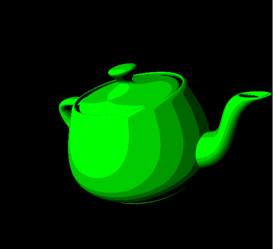
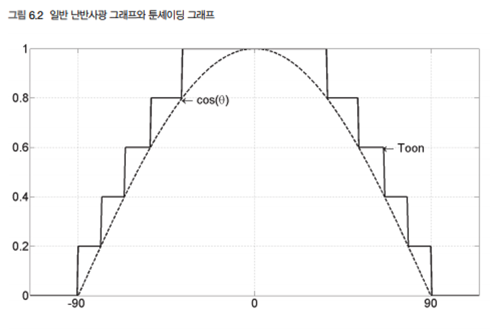

[책 셰이더 프로그래밍 입문 (저자 : Pope Kim)](https://www.hanbit.co.kr/store/books/look.php?p_code=B8421024205)을 보면서 작성했습니다.  

# 툰셰이더
게임에서는 사실적인 그래픽도 좋지만, 미적 스타일을 갖춘 게임들이 흥행을 더 한다. 그리고 지금 이 블로거 또한 사실적인 그래픽 보다는 이쁘거나 보기 편한 그래픽을 갖고 있는 게임이 재밌다.

  
 


(좌에서 부터 "테일즈 오브 어라이즈", "바이오쇼크 인피니트", "보더랜드")

그 중, 다양한 게임에서 사용된 툰 셰이딩을 만들어보자.

만화를 보면 명암 처리를 부드럽게 하는 대신에 칼같이 딱딱 끊어서 2~3단계로 한다.



(이번 장의 결과물이다.)  
사진을 잘 관찰해 보면 지금까지 사용했던 평범한 난반사광셰이더와 다르다. 난반사광이 부드럽게 어두워지는 대신 단계적으로 팍팍 줄어든다. 



|난반사광의 양|툰쉐이더의 양|
|:---|:---|
|0|0|
|0~0.2|0.2|
|0.2~0.4|0.4|
|0.4~0.6|0.6|

난반사광의 값을 가져다 0.2 단위로 무조건 올림을 하면 툰셰이더 값이 나온다.

## 셰이더

이번에는 행렬을 World, View, Projection으로 나누지 않고, 한번에 만들어 진행한다. 그런데 중간의 난반사광을 계산하려면 월드 행렬이 필요했다.   

일단 구하는 과정을 생각해보자, 정점의 위치와 법선을 월드공간으로 변환하는 이유는 빛의 위치가 월드공간에 정의되어 있어서였다. 그래야 모든 변수가 동일한 공간에 있어야만 올바른 결과를 구할 수 있기 때문이다.  
그럼 정점의 위치와 법선벡터를 월드공가느오 변환하는 대신에 빛의 위치를 지역공간으로 변환하면 어떻게 수들이 동일한 공간에 있게 된다. 이 방법은 행렬을 한번만 곱하기 때문에 조금 더 빠르다.될까?  그러면 정점의 위치와 법선에 손을 대지 않아도 모든 매개변수들이 동일한 공간에 있게 된다. 이 방법은 행렬을 한번만 곱하기 때문에 조금 더 빠르다.

### 정점셰이더

<details>
<summary style="color:green">정점셰이더</summary>
<div markdown="1">

```
struct VS_INPUT
{
   float4 mPosition : POSITION;
   float3 mNormal : NORMAL;
};

struct VS_OUTPUT
{
   float4 mPosition : POSITION;
   float3 mDiffuse : TEXCOORD1;
};

float4x4 gWorldViewProjectionMatrix;
float4x4 gInvWorldMatrix;

float4 gWorldLightPosition;

VS_OUTPUT vs_main(VS_INPUT Input)
{
   VS_OUTPUT Output;
   
   Output.mPosition = mul(Input.mPosition, gWorldViewProjectionMatrix);
   
   float3 objectLightPosition = mul(gWorldLightPosition, gInvWorldMatrix);
   float3 lightDir = normalize(Input.mPosition.xyz - objectLightPosition);
   
   Output.mDiffuse = dot(-lightDir, normalize(Input.mNormal));
   
   return (Output);
}
```

</div>
</details>

입출력 컨테이너는 간단하다.

그리고 이 전에 설명했던 행렬 2개와 광원의 위치에 대한 전역변수를 선언
```
float4x4 gWorldViewProjectionMatrix;
float4x4 gInvWorldMatrix;

float4 gWorldLightPosition;
```

한번에 월드, 뷰, 투영행렬을 합친다.
```
VS_OUTPUT Output;
   
Output.mPosition = mul(Input.mPosition, gWorldViewProjectionMatrix);
```
(간-단)  
난반사양 계산하는 차례이다. 앞에 말한 빛의 위치를 지역공간으로 변화낳ㄴ 뒤, 모든 계산을 이 공간에서 한다. 우선 빛의 위치를 지역공간으로 변환한다.

```
float3 objectLightPosition = mul(gWorldLightPosition, gInvWorldMatrix);
```
이제 광원의 위치에서 현재 우ㅚ치를 가리키는 방향벡터를 만든다. 이 방향벡터의 길이를 1로 만들어준다.

```
float3 lightDir = normalize(Input.mPosition.xyz - objectLightPosition);
```
그 결과와 정점의 법선간의 내적을 구하면 난반사광의 양을 구할 수 있다.
```
Output.mDiffuse = dot(-lightDir, normalize(Input.mNormal));
```

### 픽셀셰이더
<details>
<summary style="color:green">픽셀셰이더</summary>
<div markdown="1">

```
float3 gSurfaceColor;

struct PS_INPUT
{
   float3 mDiffuse : TEXCOORD1;
};

float4 ps_main(PS_INPUT Input) : Color
{
   float3 diffuse = saturate(Input.mDiffuse);
   
   diffuse = ceil(diffuse * 5) / 5.0f;
   
   return float4(gSurfaceColor * diffuse.xyz, 1);
}
```

</div>
</details>

우선 mDiffuse에서 필요 없는 0 이하의 값을 잘라낸다.
```
float3 diffuse = saturate(Input.mDiffuse);
```
이제 이 값을 0.2로 잘라낸다. 0.2 단위로 무조건 을림을 하면 된다. ceil()이 항상 올림을 하는 함수인데 0.2 단위로 올림을 하기 위해서는 곱셈과 나눈셈을 하면 된다.

```
diffuse = ceil(diffuse * 5) / 5.0f;
```

미지막으로 표면의 색을 곱하기만 하면 끝이다.
```
return float4(gSurfaceColor * diffuse.xyz, 1);
```

