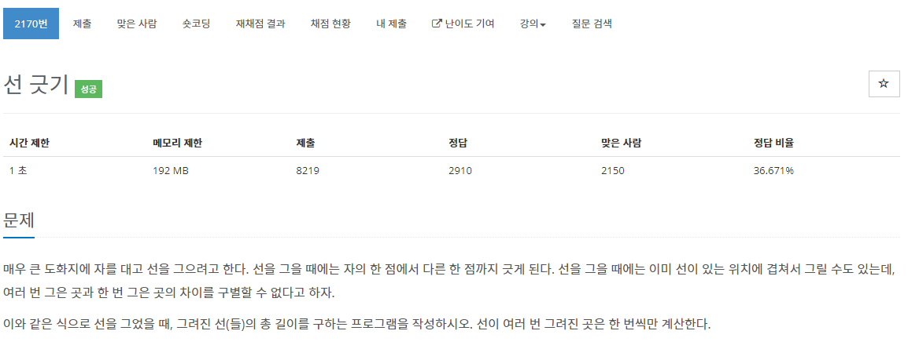

[문제](https://www.acmicpc.net/problem/2170)

스위핑 이라는 알고리즘 문제를 처음 풀어봤다.  
선을 이었을 때, 선의 길이를 측정하는 알고리즘이다.  
생각보다 간단하다.  

오름차순으로 세팅한 뒤, 이어졌을 때 시작과 끝을 업데이트 해주고, 이어지지 않는 선일 경우 길이를 더해주고 시작과 끝을 업데이트 해주자.

```
#include <iostream>
#include <vector>
#include <algorithm>

using namespace std;

constexpr int INF = 99999999;

struct Node
{
	int start, end;

	bool operator < (const Node& value) const
	{
		if(this->start == value. start)
		{
			return this->end < value.end;
		}
		return this->start < value.start;
	}
};

void Swap(int& lValue, int& rValue)
{
	int temp = lValue;
	lValue = rValue;
	rValue = temp;
}

bool Compare(const Node& lValue, const Node& rValue)
{
	return lValue.start < rValue.start;
}

int main()
{
	ios_base::sync_with_stdio(false);
	cin.tie(NULL);
	cout.tie(NULL);

	int N;
	cin >> N;
	vector<Node> v(N);

	for(int i = 0 ; i < N ;i++)
	{		
		cin >> v[i].start >> v[i].end;
		if(v[i].start > v[i].end)
		{
			Swap(v[i].start, v[i].end);
		}
	}

	sort(v.begin(), v.end(), Compare);

	int start = v[0].start, end = v[0].end;
	int answer = 0;

	for(int i = 0; i < N; i++)
	{
		if(end > v[i].start)
		{
			end = max(end, v[i].end);
		}

		else
		{
			answer += end - start;
			start = v[i].start;
			end = v[i].end;
		}
	}

	answer += end - start;
	cout << answer << endl;
}
```
```
ios_base::sync_with_stdio(false);
cin.tie(NULL);
cout.tie(NULL);
```
후... 저거 안써서 속도초과가 계속 났다 ㅡㅡ