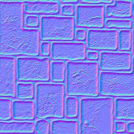

[책 셰이더 프로그래밍 입문 (저자 : Pope Kim)](https://www.hanbit.co.kr/store/books/look.php?p_code=B8421024205)을 보면서 작성했습니다.  

# 법선매핑(Normal Mapping)
물체를 보면 매끄러운 물체보단 울퉁불퉁한 물체가 많다. 이 전에 만들었던 벽돌 텍스쳐를 입힌 물체를 울퉁불퉁하게 만드는 방법은 무엇이 있을까?  
그냥 단간하게 폴리곤을 많이 만들면 되긴 한다. 하지만, 그만큼 연산이 많이 필요해서 속도도 느려지고, 메모리도 많이 차지하게 된다.  

일단 울퉁불퉁한 표면과 평평한 표면의 차이점은 무엇일까?  


왼쪽 그림은 평평한 면의 법선을, 오른쪽 그림은 울퉁불퉁한 표면의 법선을 그려본 것이다.  
조명을 계산할 때, 각 정점에서 법선 정보를 구해왔었다. 울퉁불퉁한 표면읠 제대로 표현하려면 정점의 수를 늘려야 하므로, 우리에게는 별로 도움이 되지 않다.


[출처](https://wjdgh283.tistory.com/entry/7-%EB%B2%95%EC%84%A0%EB%A7%A4%ED%95%91)

픽셀 수준에서 제어하고 싶은 매개변수를 정의하는 방법을 배웠었다. Diffuse/SpecularMap이 그랬다. 여기서도 똑같이 사용하면 된다. 여기서는 각 텍셀에 법선을 저장하면 된다.   
그리고 이 값을 나중에 픽셀셰이더에서 불러와서 조명계산에 사용하면 된다. 이렇게 각 픽셀에 사용할 법선 정보를 담고있는 텍스처를 법선맵(NormalMap), 그리고 법선맵을 이요해서 조명을 계산하는 기법을 법선매핑(NormalMapping)이라고 한다.

## 법선맵(NormalMap)
법선은 3차원 공간에 존재하는 방향벡터이므로 3개의 성분을 가진다. 텍스처에는 RGB채널이 있기 때문에 XYZ를 각각 RGB에 대입하면 된다. RGB는 0~1의 값을 갖기 때문에 정규화된 단위벡터로 사용하는게 보통이다.  
그럼 단위벡터가 0이하의 값을 갖게되면 처리를 해줘야 한다. 따라서 벡터의 -1을 텍스처의 0으로 맞추고 +1을 텍스처의 +1로 맞추면 된다. 이렇게 하면 벡터에서 0인 값이 텍스처에서는 0.5가 된다.
```
법선맵 RGB = 법선벡터 XYZ * 0.5 + 0.5
```
그러면 법선맵을 법선벡터로 바꾸는 공식은
```
법선벡터 XYZ = 법선맵 RGB * 2 - 1
```
이 된다.

## 접선공간
이 전에 법선벡터를 텍스처에 저장하는 법을 알아봤다. 과연 xyz가 의미하는 것이 무엇일까?


법선 매핑에서 가장 널리 사용되는 공간의 XYZ좌표계이다.  
즉 표면에 수직인 방향을 z로 삼고 표면의 오른쪽을 x로 삼으면, y는 이 두 방향에서 모두 직각인 제3의 방향이 된다. 그러면 이게 무근 공간일까?  


그림에서 왼쪽과 오른쪽 면에 동일한 법선맵을 사용한다고 가정해보자. 왼쪽 면에서는 표면의 방향이 왼쪽으므로 벡터(0,0,1)이 왼쪽을 향해야 한다. 이제 오른쪽 면을 보면 표면의 방향이 오른쪽이다. 그럼 (0,0,1)이 오른쪽을 향한다. 뭐지 이상하다.  

여기서 사용하는 공간은 각 물체마다 정의된 공간이 아니라 각 표면마다 정의되어 있다. '표면의 바깥쪽 방향을 법선의 +z로 둔다.'는 명제를 사용하며 법선맵을 만들기 때문에 당연히 각 표면마다 다른 공간이 존재합니다.

그렇다면 법선 정보가 접성 공간에 존재하기 때문에 공간변환이 필요하다. 빛과 카메라의 위치는 월드공간에 존재하므로 다른 공간과 접선공간 사이에서 변환을 하려면 하나의 행렬이 필요하다.

접선공간을 구성하는 행렬은 좌표축 3개만 있다면 쉽게 만들 수 있다. Z축은 정점의 법선과 같고 X는 표면위를 달리는 축이므로 표면 위에 있는 정보에서 구하면 된다. UV에서 하나를 갖고와 그것을 X로 두면 된다., 그리고 나머지 축은 외적을 사용해서 구하면 된다.

## 법선맵을 읽는 법


노멀맵이다. 뭔 푸르딩딩한 이미지가 있다. 왜 파란색이 많을까?  
파란색이면 b채널이고 이것은 법선의 z이고 법사읜 z방향은 표면의 바깥쪽 방향이기 때문이다.  
따라서 z값이 최소한 0보다 큰것이고, z값의 범위가 ~-1이라는 건데 이걸 텍스처에 저장하면 0.5~1이 되므로 파란색이 최소한 절방 이상이 있다는 것이다.

그럼 가장자리에 있는 붉은색 하이라이트는 뭘까? 이 돌판은 앞으로 튀어나와 있다. 그럼 돌판의 오른쪽 가장자리에서 법선은 어디를 향할까?  오른쪽이다.  
그럼 법선벡터가(1,0,0)이 된다. 이것을 RGB로 바꾸면 (1, 0.5, 0.5)가 되므로 빨강색이 강한게 맞다.  
그럼 욎고 가장자리는 위쪽을 향해야 하므로 (-1,0,0)이 된다. 이것을 RGb로 바꾸면 (0,0.5,0.5)가 된다. 빨강색이 사라져서 어두워지는게 맞다.

수학적으로 이해는 간다. 그런데 아무리 봐도 돌판이 들어간 것으로 보이지 않는다.  
이유는 녹색 하이라이트가 아래쪽에 들어가 있기 때문이다. 인간의 누는 위쪽에 있는 하이라이트에 익숙하다. 