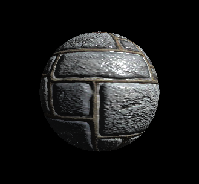

[책 셰이더 프로그래밍 입문 (저자 : Pope Kim)](https://www.hanbit.co.kr/store/books/look.php?p_code=B8421024205)을 보면서 작성했습니다.  

# 법선매핑(Normal Mapping)
## 정점셰이더

<details>
<summary style="color:green">정점셰이더</summary>
<div markdown="1">

```
struct VS_INPUT
{
   float4 mPosition : POSITION;
   float3 mNormal : NORMAL;
   float3 mTangent : TANGENT;
   float3 mBinormal : BINORMAL;
   float2 mUV : TEXCOORD0;
};

struct VS_OUTPUT
{ 
   float4 mPosition : POSITION;
   float2 mUV : TEXCOORD0;
   float3 mLightDir : TEXCOORD1;
   float3 mViewDir : TEXCOORD2;
   float3 T : TEXCOORD3;
   float3 B : TEXCOORD4;
   float3 N : TEXCOORD5;
};

float4x4 gWorldMatrix;
float4x4 gWorldViewProjectionMatrix;

float4 gWorldLightPosition;
float4 gWorldCameraPosition;

VS_OUTPUT vs_main(VS_INPUT Input)
{
   VS_OUTPUT Output;
   
   Output.mPosition = mul(Input.mPosition, gWorldViewProjectionMatrix);
   Output.mUV = Input.mUV;
   
   float4 worldPosition = mul(Input.mPosition, gWorldMatrix);
   float3 lightDir = worldPosition.xyz - gWorldLightPosition.xyz;
   Output.mLightDir = normalize(lightDir);
   
   float3 viewDir = normalize(worldPosition.xyz - gWorldCameraPosition.xyz);
   Output.mViewDir = viewDir;
   
   float3 worldNormal = mul(Input.mNormal, (float3x3)gWorldMatrix);
   Output.N = normalize(worldNormal);
   
   float3 worldTangent = mul(Input.mTangent, (float3x3)gWorldMatrix);
   Output.T = normalize(worldTangent);
   
   float3 worldBinormal = mul(Input.mBinormal, (float3x3)gWorldMatrix);
   Output.B = normalize(worldBinormal);
   
   return Output;
}
```

</div>
</details>

### 입출력 셰이더

정점셰이더의 입력데이터에 접선과 종법선 정보를 더해 줘야 한다. 정접 입력데이터의 시맨틱으로 TANGENT 와 BINORMAL이 있으므로 이들을 사용하여 새로운 멤버변수를 정의한다.

```
struct VS_INPUT
{
   float4 mPosition : POSITION;
   float3 mNormal : NORMAL;
   float3 mTangent : TANGENT;
   float3 mBinormal : BINORMAL;
   float2 mUV : TEXCOORD0;
};
```

```
struct VS_OUTPUT
{ 
   float4 mPosition : POSITION;
   float2 mUV : TEXCOORD0;
   float3 mLightDir : TEXCOORD1;
   float3 mViewDir : TEXCOORD2;
   float3 T : TEXCOORD3;
   float3 B : TEXCOORD4;
   float3 N : TEXCOORD5;
};
```
출력 데이터 부분이다. 위치와 UV좌표는 당연히 전달해 줘야 하기 때문에 그렇다 치더라도 난반사광의 냥을 계산한 결과인 mDiffuse는 의문이 생긴다.  
이 전에 이 값을 계산하기 위해서는 내적을 활용했다. 그런데 조명계산에 사용하는 법선은 어디서 구해야 할까?  
법선 텍스처에서 법선을 읽어와야 한다. 그런데 정점셰이더 단계에서는 조명계산에 유효한 법선 데이터가 없으므로 mDiffuse는 제외시켜주자.  

mReflection변수는 이사광베거를 반사시킨 것이다. 그런데 반사시킬 때 법선을 사용했으므로 올바른 법선정보 없이는 이 앖도 구할 수 없다. 따라서 제외시키자  
정점셰이더에서 이미 mLightDir을 반환하므로 픽셀셰이더에서 mLightDir로부터 반사벡터를 수할 수 있다.

```
struct VS_OUTPUT
{ 
   float4 mPosition : POSITION;
   float2 mUV : TEXCOORD0;
   float3 mLightDir : TEXCOORD1;
   float3 mViewDir : TEXCOORD2;
}
```
여기까지 수정된 구조체이다.  
 그렇다면 입력데이터로 받았던 법선, 접선, 종법선 정보는 어떻게 할까?  
 접선공간을 변환하기 위해서 이 세개의 벡터가 필요하다.  
 모든 변수가 월드공간에 있어야 한다. 조명계산에 필요한 벡터는 결국 입사광벡터, 카메라벡터, 법선벡터 뿐이다. 입사광벡터와 카메라벡터는 정점셰이더에서 월드공간으로 변환할 수 있다.  
 그렇가면 법선은 어떨까? 법선은 텍스처에서 읽어오므로 표면공간, 즉 접선공간에 존재한다. 이것을 월드공간으로 변환해야만 제대로 된 계산을 할 수 있다.  
 그러려면 픽셀셰이더에서 법선/접선/종법선벡터를 사용할 수 있어야 만 접선공간 <-> 월드공간 사이를 변환하는 행렬을 만들 수 있습니다. 따라서 이 세 벡터들을 정점셰이더에서 반환해줘야 한다.

 ```
 struct VS_OUTPUT
{ 
   float4 mPosition : POSITION;
   float2 mUV : TEXCOORD0;
   float3 mLightDir : TEXCOORD1;
   float3 mViewDir : TEXCOORD2;
   float3 T : TEXCOORD3;
   float3 B : TEXCOORD4;
   float3 N : TEXCOORD5;
};
 ```

 ### Main
 일단 행렬 변환 해준뒤, UV는 변환이 필요한 것이 아니기 때문에 바로 전달해준다.  

 ```
VS_OUTPUT Output;
   
Output.mPosition = mul(Input.mPosition, gWorldViewProjectionMatrix);
Output.mUV = Input.mUV;
```
입사광의 방향벡터와 카메라 벡터를 구하자.  
이 두 벡터를 구하기 위해서는 월드공간에서의 정점위치가 필요하다.  
Input.mPosition에서 gWorldMatrix를 곱해서 월드공간에서의 위치를 구하자
```
float4 worldPosition = mul(Input.mPosition, gWorldMatrix);
```
월드공간에서의 위치도 구했다면 여기서 광원의 위치와 카메라의 위치를 빼는 것만으로도 쉽게 두 벡터를 구할 수 있다.  

```
float3 lightDir = worldPosition.xyz - gWorldLightPosition.xyz;
Output.mLightDir = normalize(lightDir);
   
float3 viewDir = normalize(worldPosition.xyz - gWorldCameraPosition.xyz);
Output.mViewDir = viewDir;
```
마지막으로 법선, 접선, 종법선벡터를 픽셀셰이더에 전해줄 차례다.  
현재 벡터들은 물체공간에 있다. 우선 월드공간과 접선공간 사이에서 변환을 해야 하기 때문에 월드 공간으로 변환을 하자.  
```
float3 worldNormal = mul(Input.mNormal, (float3x3)gWorldMatrix);
Output.N = normalize(worldNormal);
   
float3 worldTangent = mul(Input.mTangent, (float3x3)gWorldMatrix);
Output.T = normalize(worldTangent);
   
float3 worldBinormal = mul(Input.mBinormal, (float3x3)gWorldMatrix);
Output.B = normalize(worldBinormal);
```
마지막으로 반환을 해주면 된다.

## 픽셀셰이더
<details>
<summary style="color:green">픽셀셰이더</summary>
<div markdown="1">

```
struct PS_INPUT
{
   float2 mUV : TEXCOORD0;
   float3 mLightDir : TEXCOORD1;
   float3 mViewDir : TEXCOORD2;
   float3 T : TEXCOORD3;
   float3 B : TEXCOORD4;
   float3 N : TEXCOORD5;
};

sampler2D DiffuseSampler;
sampler2D SpecularSampler;
sampler2D NormalSampler;

float3 gLightColor;

float4 ps_main(PS_INPUT Input) : COLOR
{
   float3 tangentNormal = tex2D(NormalSampler, Input.mUV).xyz;
   tangentNormal = normalize(tangentNormal * 2 -1);
   
   float3x3 TBN = float3x3(normalize(Input.T), normalize(Input.B), normalize(Input.N));
   TBN = transpose(TBN);
   float3 worldNormal = mul(TBN, tangentNormal);
   
   float4 albedo = tex2D(DiffuseSampler, Input.mUV);
   float3 lightDir = normalize(Input.mLightDir);
   float3 diffuse = saturate(dot(worldNormal, -lightDir));
   diffuse = gLightColor * albedo.rgb * diffuse;
   
   float3 specular = 0;
   if(diffuse.x > 0)
   {
      float3 reflection = reflect(lightDir, worldNormal);
      float3 viewDir = normalize(Input.mViewDir);
      
      specular = saturate(dot(reflection, -viewDir));
      specular = pow(specular, 20.0f);
      
      float4 specularIntensity = tex2D(SpecularSampler, Input.mUV);
      specular *= specularIntensity.rgb * gLightColor;
   }
   
   float3 ambient = float3(0.1f, 0.1f, 0.1f) * albedo;
   
   return float4(ambient + diffuse + specular, 1);
}
```

</div>
</details>

### Input데이터와 전역변수
Input데이터로는 정점셰이더에서 받은 데이터를 토대로 작성하고, Diffuse, Specular, Normal텍스처를 갖고오고 빛의 색상도 갖고오자
```
struct PS_INPUT
{
   float2 mUV : TEXCOORD0;
   float3 mLightDir : TEXCOORD1;
   float3 mViewDir : TEXCOORD2;
   float3 T : TEXCOORD3;
   float3 B : TEXCOORD4;
   float3 N : TEXCOORD5;
};

sampler2D DiffuseSampler;
sampler2D SpecularSampler;
sampler2D NormalSampler;

float3 gLightColor;
```

### Main
우선 NormalMap텍스처로부터 NormalVector를 읽어오자
```
float3 tangentNormal = tex2D(NormalSampler, Input.mUV).xyz;
```

텍스처로 읽어 온 텍셀의 값의 범위는 0~1이다. 그런데 실제 법선의 범위는 -1~+1이기 때문에 다시 원래대로 확장해주자
```
tangentNormal = normalize(tangentNormal * 2 -1);
```
이제 현재 픽셀에서 사용할 접선공간 법선을 구했다. 이제 이것을 월드공간으로 변환해야 조명계산을 할 수 있다.  
TBN벡터로 행렬을 하나 만들자
```
float3x3 TBN = float3x3(normalize(Input.T), normalize(Input.B), normalize(Input.N));
```
하지만, 이 해렬은 월드공간을 접선공간으로 변환하는 행렬이다. 우리는 접성공간에 있는 법선을 월드공간으로 변환해야 하므로 역행렬이 필요하다.
```
TBN = transpose(TBN);
```

마지막으로 tangentNormal에 곱해서 월드공간에서의 법선을 구하자
```
float3 worldNormal = mul(TBN, tangentNormal);
```
지금까진 (벡터 행렬)순으로 연산했는데 위에는 (행렬, 벡터)순으로 곱했다. float3x3의 생성자를 이용하면 행기준 행렬이 오기 때문이다.

난반사광의 양과 빛의 색상을 곱해주자
```
float4 albedo = tex2D(DiffuseSampler, Input.mUV);
float3 lightDir = normalize(Input.mLightDir);
float3 diffuse = saturate(dot(worldNormal, -lightDir));
diffuse = gLightColor * albedo.rgb * diffuse;
```

다음은 정반사광을 구해주자
```
float3 specular = 0;
if(diffuse.x > 0)
{
  float3 reflection = reflect(lightDir, worldNormal);
  float3 viewDir = normalize(Input.mViewDir);
      
  specular = saturate(dot(reflection, -viewDir));
  specular = pow(specular, 20.0f);
      
  float4 specularIntensity = tex2D(SpecularSampler, Input.mUV);
  specular *= specularIntensity.rgb * gLightColor;
}
```
마지막으로 모든 결과를 더해주자
```   
float3 ambient = float3(0.1f, 0.1f, 0.1f) * albedo;
   
return float4(ambient + diffuse + specular, 1);
```

## 결과


와 점점 그럴듯하게 잘 나온다.