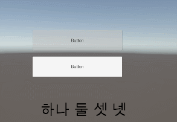

처음에 UnitySentis 2.1.0 버전이 최신이라 사용 했는데 뭔가... 아직 정보도 많이 부족하기도 하고, https://huggingface.co/unity/sentis-whisper-tiny 이걸 사용했지만, 한국어를 제대로 인식 못하는 상태이다... ㅠㅠ (그리고 이걸 수정하는걸 AI의 도움을 받으려 했지만... 걔도 이상하게 수정해주더라 ㅋㅋ)

그래서 일단 이전 버전인 1.5.0-pre 버전을 사용해서 구현을 해보았다.

일단, 기존에 있던 RunWishper를 약간 수정했다.
```
using System.Collections;
using UnityEngine;
using Unity.Sentis;
using System.IO;
using Newtonsoft.Json;
using System.Text;
using System;
using System.Collections.Generic;
using System.Linq;

public class RunWhisper : MonoBehaviour
{
    public enum WhisperModel { Tiny, Medium, Base }

    IWorker decoderEngine, encoderEngine, spectroEngine;

    const BackendType backend = BackendType.GPUCompute;

    private AudioClip audioClip;

    // Maximum tokens for output
    const int maxTokens = 100;

    // Special tokens
    const int END_OF_TEXT = 50257;
    const int START_OF_TRANSCRIPT = 50258;
    const int KOREAN = 50264;
    const int TRANSCRIBE = 50359;
    const int NO_TIME_STAMPS = 50363;
    const int START_TIME = 50364;

    int numSamples;
    float[] data;
    string[] tokens;

    int currentToken = 0;
    int[] outputTokens = new int[maxTokens];

    // Special character decoding
    int[] whiteSpaceCharacters = new int[256];

    TensorFloat encodedAudio;

    bool transcribe = false;
    string outputString = "";

    // Maximum size of audioClip (30s at 16kHz)
    const int maxSamples = 30 * 16000;

    private Action<string> transcriptionCompleteCallback;

    private Dictionary<int, string> vocab;
    private List<byte> byteBuffer = new List<byte>();

    void Start()
    {
        SetupWhiteSpaceShifts();
        GetTokens();

        //@note: no default reload to avoid conflict with decisionsystem's reload 

        string vocabPath = Application.streamingAssetsPath + "/multilingual.tiktoken";

        Dictionary<string, int> ranks = File.ReadLines(vocabPath)
            .Where(line => !string.IsNullOrWhiteSpace(line))
            .Select(line => line.Split())
            .ToDictionary(
                split => split[0], // Base64 
                split => int.Parse(split[1])
            );

        Dictionary<int, string> d = ranks.ToDictionary(
            kvp => kvp.Value,
            kvp => kvp.Key // Base64
        );

        //vocab dictionary to be saved and used in decoding elsewhere 
        vocab = d.ToDictionary(entry => entry.Key, entry => entry.Value);

    }

    public void ReloadModel()
    {
        decoderEngine?.Dispose();
        encoderEngine?.Dispose();
        spectroEngine?.Dispose();

        Model decoder = ModelLoader.Load(Application.streamingAssetsPath + "/AudioDecoder_Tiny.sentis"); //flag
        Model encoder = ModelLoader.Load(Application.streamingAssetsPath + "/AudioEncoder_Tiny.sentis"); //flag
        Model decoderWithArgMax = Functional.Compile(
            (tokens, audio) => Functional.ArgMax(decoder.Forward(tokens, audio)[0], 2),
            (decoder.inputs[0], decoder.inputs[1])
        );
        Model spectro = ModelLoader.Load(Application.streamingAssetsPath + "/LogMelSepctro.sentis");

        decoderEngine = WorkerFactory.CreateWorker(backend, decoderWithArgMax);
        encoderEngine = WorkerFactory.CreateWorker(backend, encoder);
        spectroEngine = WorkerFactory.CreateWorker(backend, spectro);

    }

    public void StartTranscription(AudioClip clip, Action<string> callback = null)
    {
        audioClip = clip;
        transcriptionCompleteCallback = callback;

        outputTokens[0] = START_OF_TRANSCRIPT;
        outputTokens[1] = KOREAN;
        outputTokens[2] = TRANSCRIBE;
        outputTokens[3] = NO_TIME_STAMPS;
        currentToken = 3;
        outputString = "";

        LoadAudio();
        EncodeAudio();

        transcribe = true;
    }

    void LoadAudio()
    {
        if (audioClip.frequency != 16000)
        {
            Debug.Log($"The audio clip should have frequency 16kHz. It has frequency {audioClip.frequency / 1000f}kHz");
            return;
        }

        numSamples = audioClip.samples;

        if (numSamples > maxSamples)
        {
            Debug.Log($"The AudioClip is too long. It must be less than 30 seconds. This clip is {numSamples / audioClip.frequency} seconds.");
            return;
        }

        data = new float[maxSamples];
        numSamples = maxSamples;
        audioClip.GetData(data, 0);
    }

    void EncodeAudio()
    {
        using var input = new TensorFloat(new TensorShape(1, numSamples), data);

        spectroEngine.Execute(input);
        var spectroOutput = spectroEngine.PeekOutput() as TensorFloat;

        encoderEngine.Execute(spectroOutput);
        encodedAudio = encoderEngine.PeekOutput() as TensorFloat;
    }

    void Update()
    {
        if (transcribe && currentToken < outputTokens.Length - 1)
        {
            using var tokensSoFar = new TensorInt(new TensorShape(1, outputTokens.Length), outputTokens);

            var inputs = new Dictionary<string, Tensor>
            {
                {"input_0", tokensSoFar },
                {"input_1", encodedAudio }
            };

            decoderEngine.Execute(inputs);
            var tokensPredictions = decoderEngine.PeekOutput() as TensorInt;

            tokensPredictions.CompleteOperationsAndDownload();

            int ID = tokensPredictions[currentToken];

            outputTokens[++currentToken] = ID;

            if (ID == END_OF_TEXT)
            {
                transcribe = false;
                transcriptionCompleteCallback?.Invoke(outputString);
            }
            else if (ID >= tokens.Length)
            {
                Debug.LogWarning($"Token ID {ID} is larger than {tokens.Length}");
                outputString += $"(time={(ID - START_TIME) * 0.02f})";
            }
            else
            {
                outputString += DecodeID(ID);
            }

            Debug.Log(outputString);
        }
    }

    private string DecodeID(int id)
    {
        byte[] decodedBytes = new byte[] { };
        if (vocab.ContainsKey(id))
        {
            string base64String = vocab[id];
            try
            {
                decodedBytes = Convert.FromBase64String(base64String);
            }
            catch (FormatException ex)
            {
                Debug.LogWarning($"Warning: Error decoding Base64 for value {id}: {ex.Message}");
            }
        }
        else
        {
            Debug.LogWarning($"Warning: Value {id} not found in the dictionary.");
        }

        string decodedString = ProcessDecodedBytes(decodedBytes);

        return decodedString;
    }

    private string ProcessDecodedBytes(byte[] decodedBytes)
    {
        string result = string.Empty;

        foreach (byte b in decodedBytes)
        {
            byteBuffer.Add(b);
            if (IsCompleteUTF8Sequence(byteBuffer))
            {
                try
                {
                    result += Encoding.UTF8.GetString(byteBuffer.ToArray());
                    byteBuffer.Clear();
                }
                catch (Exception ex)
                {
                    Debug.LogError("Error decoding bytes to UTF-8: " + ex.Message);
                    byteBuffer.Clear();
                }
            }
        }

        return result;
    }

    private bool IsCompleteUTF8Sequence(List<byte> byteList)
    {
        byte firstByte = byteList[0];

        // Single byte (ASCII)
        if (firstByte <= 0x7F) return true;

        // Two-byte sequence (110xxxxx 10xxxxxx)
        if (firstByte >= 0xC2 && firstByte <= 0xDF && byteList.Count >= 2)
        {
            return (byteList[1] & 0xC0) == 0x80; // Check if the second byte starts with 10xxxxxx
        }

        // Three-byte sequence (1110xxxx 10xxxxxx 10xxxxxx)
        if (firstByte >= 0xE0 && firstByte <= 0xEF && byteList.Count >= 3)
        {
            return (byteList[1] & 0xC0) == 0x80 && (byteList[2] & 0xC0) == 0x80;
        }

        // Four-byte sequence (11110xxx 10xxxxxx 10xxxxxx 10xxxxxx)
        if (firstByte >= 0xF0 && firstByte <= 0xF7 && byteList.Count >= 4)
        {
            return (byteList[1] & 0xC0) == 0x80 && (byteList[2] & 0xC0) == 0x80 && (byteList[3] & 0xC0) == 0x80;
        }

        // If not yet complete, return false
        return false;
    }

    string GetUnicodeText(string text)
    {
        var bytes = Encoding.GetEncoding("ISO-8859-1").GetBytes(ShiftCharacterDown(text));
        return Encoding.UTF8.GetString(bytes);
    }

    string ShiftCharacterDown(string text)
    {
        string outText = "";
        foreach (char letter in text)
        {
            outText += ((int)letter <= 256) ? letter :
                (char)whiteSpaceCharacters[(int)(letter - 256)];
        }
        Debug.Log("outText:" + string.Join(", ", outText));
        return outText;
    }

    void SetupWhiteSpaceShifts()
    {
        for (int i = 0, n = 0; i < 256; i++)
        {
            if (IsWhiteSpace((char)i)) whiteSpaceCharacters[n++] = i;
        }
    }

    bool IsWhiteSpace(char c)
    {
        return !(('!' <= c && c <= '~') || ('?' <= c && c <= '?') || ('?' <= c && c <= '?'));
    }

    void GetTokens()
    {
        string vocabFilePath = Path.Combine(Application.streamingAssetsPath, "vocab.json");

        if (!File.Exists(vocabFilePath))
        {
            Debug.LogError("vocab.json file not found at: " + vocabFilePath);
            return;
        }

        var jsonText = File.ReadAllText(vocabFilePath);
        var vocab = JsonConvert.DeserializeObject<Dictionary<string, int>>(jsonText);

        tokens = new string[vocab.Count];
        foreach (var item in vocab)
        {
            tokens[item.Value] = item.Key;
        }

        Debug.Log("Tokens loaded successfully.");
    }

    private void OnDestroy()
    {
        decoderEngine?.Dispose();
        encoderEngine?.Dispose();
        spectroEngine?.Dispose();
    }
}
```

음성 인식은 만들었고... 마이크로 파일을 만들어 저장하고 음성 인식을 하는 방법으로 하면

```
using UnityEngine;
using UnityEngine.UI;
using TMPro;
using System;
using System.IO;

public class MicrophoneRecorder : MonoBehaviour
{
    public Action<string> transcriptionCompleteCallback;
    
    public AudioClip recordedClip;
    private const int maxSamples = 30 * 16000; // 30초 동안 16kHz 샘플링
    private float[] data;
    private int numSamples;

    // UI 버튼을 연결할 변수
    public Button startRecordingButton;
    public Button stopRecordingButton;

    // RunWhisper 클래스와 연결
    [SerializeField]
    private RunWhisper whisperEngine;

    [SerializeField]
    private Text transcriptionDisplay;
    [SerializeField] 
    private Text resultDisplay;

    // 오디오 파일 저장 경로
    private string saveFilePath;
    private string selectedMicrophone = null;
    
    [SerializeField]
    private int microphoneIndex = -1;

    void Start()
    {
        whisperEngine.ReloadModel();
        // Get all available microphone devices
        string[] microphones = Microphone.devices;

        if (microphones.Length > 0)
        {
            Debug.Log("Available microphones:");
            for (int i = 0; i < microphones.Length; i++)
            {
                Debug.Log(i + ": " + microphones[i]);
            }
        }
        else
        {
            Debug.Log("No microphones available.");
        }

        if (microphoneIndex != -1){
            selectedMicrophone = microphones[microphoneIndex];
        }

        Debug.Log("Selected microphone: " + selectedMicrophone);

        // 버튼에 메서드 연결
        if (startRecordingButton != null && stopRecordingButton != null)
        {
            startRecordingButton.onClick.AddListener(StartRecording);
            stopRecordingButton.onClick.AddListener(StopRecording);
            
            // 처음에는 녹음 완료 버튼 비활성화
            stopRecordingButton.interactable = false;
        }

        // 저장할 경로 설정
        saveFilePath = Path.Combine(Application.dataPath, "RecordedAudio.wav");
    }

    public void StartRecording()
    {
        // 녹음 시작
        recordedClip = Microphone.Start(selectedMicrophone, false, 30, 16000);

        // 마이크로부터 녹음이 시작될 때까지 대기
        while (!(Microphone.GetPosition(null) > 0)) { }

        Debug.Log("Microphone recording started");

        if (startRecordingButton != null && stopRecordingButton != null)
        {
            // 녹음 완료 버튼 활성화, 녹음 시작 버튼 비활성화
            startRecordingButton.interactable = false;
            stopRecordingButton.interactable = true;
        }
    }

    public void StopRecording()
    {
        if (Microphone.IsRecording(null))
        {
            // 녹음 완료
            Microphone.End(null);
            numSamples = recordedClip.samples;

            if (numSamples > maxSamples)
            {
                Debug.Log($"The AudioClip is too long. It must be less than 30 seconds. This clip is {numSamples / recordedClip.frequency} seconds.");
                return;
            }

            data = new float[maxSamples];
            numSamples = maxSamples;
            recordedClip.GetData(data, 0);

            Debug.Log("Microphone recording stopped");

            if (startRecordingButton != null && stopRecordingButton != null)
            {
                // 녹음 시작 버튼 활성화, 녹음 완료 버튼 비활성화
                startRecordingButton.interactable = true;
                stopRecordingButton.interactable = false;
            }

            // 녹음 완료 후 오디오 파일로 저장
            SaveRecordedAudio(saveFilePath);

            // 녹음 완료 후 RunWhisper를 통해 텍스트 변환 시작
            ProcessRecordedAudio();
        }
    }

    public void SaveRecordedAudio(string filepath)
    {
        if (recordedClip != null)
        {
            Directory.CreateDirectory(Path.GetDirectoryName(filepath));
            var filepathWithExtension = Path.ChangeExtension(filepath, ".wav");

            using (var fileStream = CreateEmptyWav(filepathWithExtension))
            {
                ConvertAndWriteWav(fileStream, recordedClip);
                WriteWavHeader(fileStream, recordedClip);
            }

            Debug.Log($"Audio saved at: {filepathWithExtension}");
        }
        else
        {
            Debug.LogError("No audio recorded to save.");
        }
    }

    private FileStream CreateEmptyWav(string filepath)
    {
        var fileStream = new FileStream(filepath, FileMode.Create);
        byte emptyByte = new byte();
        for (int i = 0; i < 44; i++) // WAV 헤더 공간
        {
            fileStream.WriteByte(emptyByte);
        }
        return fileStream;
    }

    private void ConvertAndWriteWav(FileStream fileStream, AudioClip clip)
    {
        var samples = new float[clip.samples * clip.channels];
        clip.GetData(samples, 0);

        var intData = new Int16[samples.Length];
        var bytesData = new Byte[samples.Length * 2];

        var rescaleFactor = 32767; // float을 Int16으로 변환

        for (var i = 0; i < samples.Length; i++)
        {
            intData[i] = (short)(samples[i] * rescaleFactor);
            var byteArray = BitConverter.GetBytes(intData[i]);
            byteArray.CopyTo(bytesData, i * 2);
        }

        fileStream.Write(bytesData, 0, bytesData.Length);
    }

    private void WriteWavHeader(FileStream fileStream, AudioClip clip)
    {
        var hz = clip.frequency;
        var channels = clip.channels;
        var samples = clip.samples;

        fileStream.Seek(0, SeekOrigin.Begin);

        fileStream.Write(System.Text.Encoding.UTF8.GetBytes("RIFF"), 0, 4);
        fileStream.Write(BitConverter.GetBytes(fileStream.Length - 8), 0, 4);
        fileStream.Write(System.Text.Encoding.UTF8.GetBytes("WAVE"), 0, 4);
        fileStream.Write(System.Text.Encoding.UTF8.GetBytes("fmt "), 0, 4);
        fileStream.Write(BitConverter.GetBytes(16), 0, 4);
        fileStream.Write(BitConverter.GetBytes((short)1), 0, 2);
        fileStream.Write(BitConverter.GetBytes((short)channels), 0, 2);
        fileStream.Write(BitConverter.GetBytes(hz), 0, 4);
        fileStream.Write(BitConverter.GetBytes(hz * channels * 2), 0, 4);
        fileStream.Write(BitConverter.GetBytes((short)(channels * 2)), 0, 2);
        fileStream.Write(BitConverter.GetBytes((short)16), 0, 2);
        fileStream.Write(System.Text.Encoding.UTF8.GetBytes("data"), 0, 4);
        fileStream.Write(BitConverter.GetBytes(samples * channels * 2), 0, 4);
    }

    // RunWhisper를 통해 녹음된 오디오 텍스트 변환 처리
    public void ProcessRecordedAudio()
    {
        if (whisperEngine != null && recordedClip != null)
        {
            // RunWhisper를 사용하여 트랜스크립션을 시작하고, 결과를 Text에 표시
            whisperEngine.StartTranscription(recordedClip, UpdateTranscriptionDisplay);
        }
        else
        {
            Debug.LogError("RunWhisper 인스턴스나 녹음된 오디오 클립이 없습니다.");
        }
    }

    // 트랜스크립션 결과를 Text에 업데이트하는 함수
    void UpdateTranscriptionDisplay(string transcription)
    {
        transcriptionCompleteCallback?.Invoke(transcription);
        if (transcriptionDisplay != null)
        {
            transcriptionDisplay.text = transcription;
        }
    }
}
```
이렇게 짜고 실행을 하면


하나 둘 셋 넷 을 말했을 때는 잘 나온다.

하지만, 말하는 것중에 영어가 섞여 있다면 의도와 다르게 나온다.


테스트 123 을 말했을 때이다.

교정하는 방법이나, 다른 모델을 사용하거나 다른 방법을 찾아봐야겠다.
(무료라서 이거 사용한건데 ㅠㅠ)