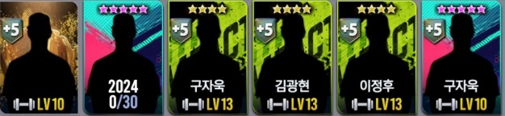
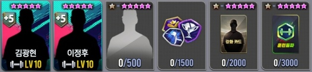
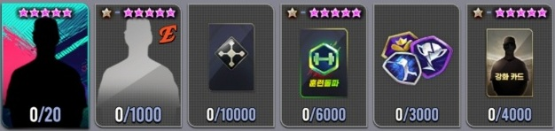
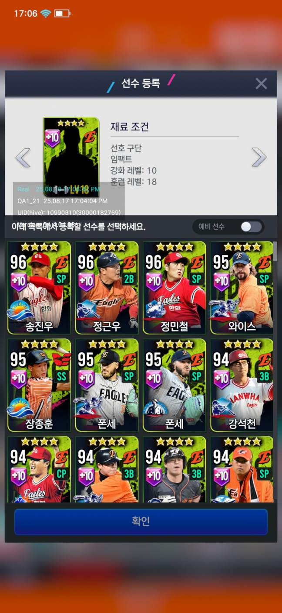
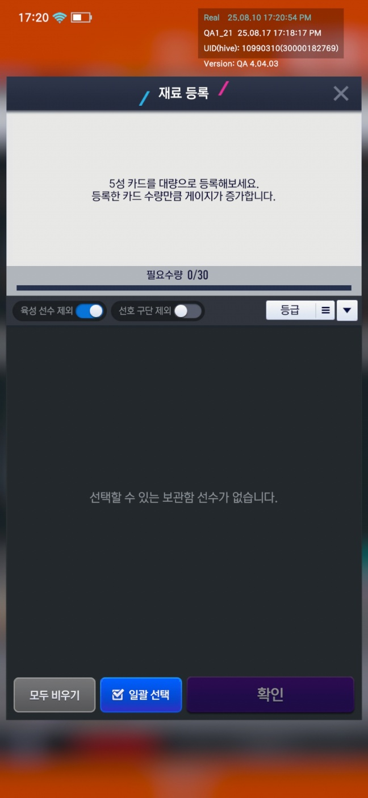
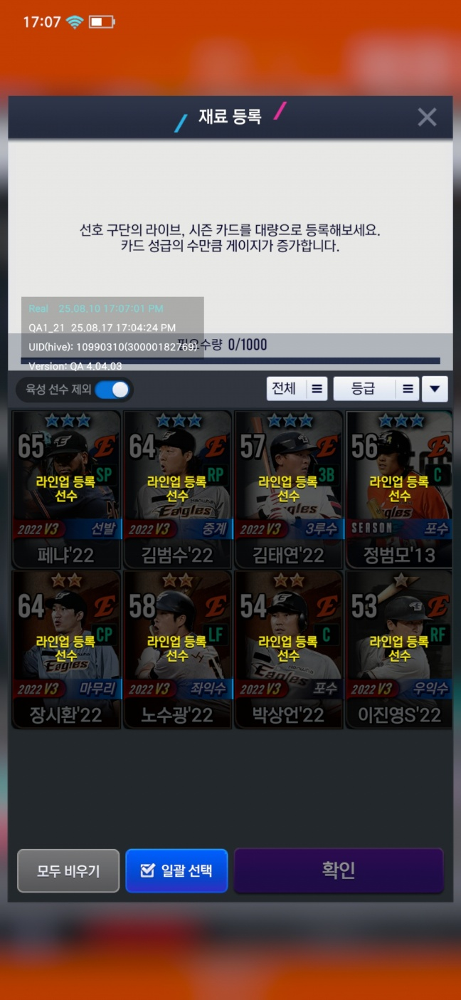
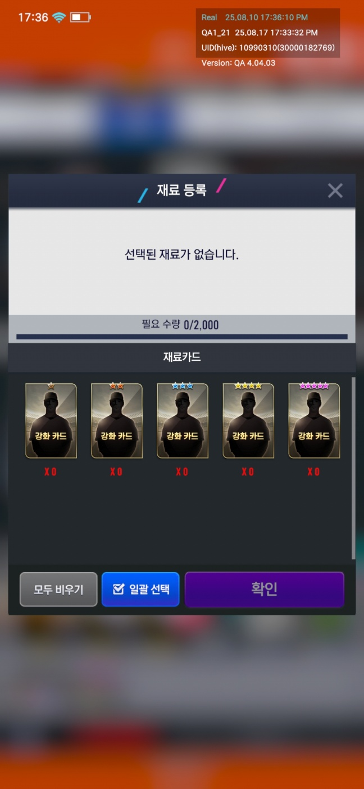
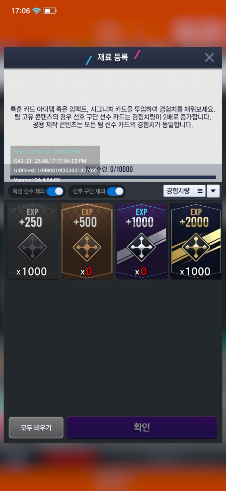
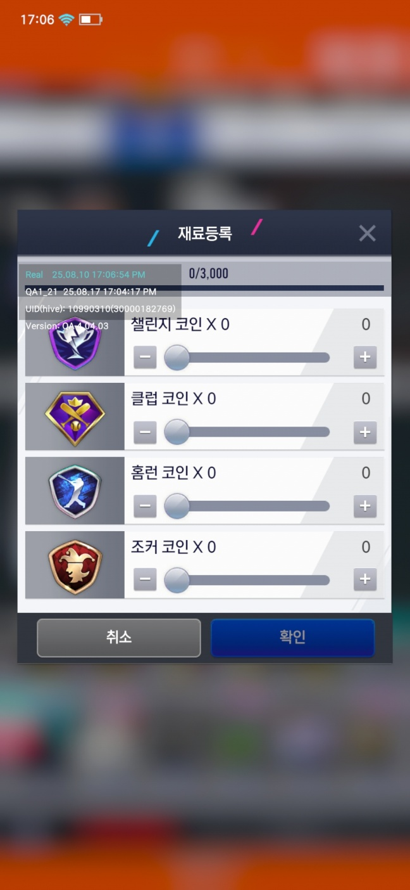

## 재료
선수 영입, 특별제작소, 락커룸 등 에서 공통된 재료 구성으로 재료를 등록함.

기획에서 만들어준 데이터를 활용해서 하나의 재료 프리팹으로 만들어 사용.

## 종류

여러가지 종류가 있음

1. 특정한 조건들을 만족하는 특정한 선수
2. 특정한 조건들을 만족하는 한장 이상의 선수들
3. 선수들의 성급(1~5성)을 넣어 필요한 성급들을 채우는 재료
4. 강화or훈련돌파 재료들을 성급만큼 채우는 재료
5. 특훈 아이템의 경험치를 채우는 재료
6. 토큰 아이템을 넣는 경우

이 조건들에 맞춰 아이템들의 이미지, 수 등을 세팅함.

## 팝업
### 특정 조건을 만족하는 선수
(특정 조건을 만족하는 선수)

재료 조건에 맞춰 자신의 인벤토리에 있는 선수들을 불러와 필터링 합니다.

예비선수 토글시 강화, 훈련레벨을 제외한 조건들을 필터링 합니다.

### 특정한 조건들을 만족하는 한장 이상의 선수들
(특정한 조건들을 만족하는 한장 이상의 선수들)

대량으로 등록 가능 합니다.

육성선수 제외 토글시 훈련/강화중 한개 이상이 1이상 했을경우 필터링 합니다.

선호구단 제회 토글시 현재 선호구단(이미지 내에선 한화)을 필터링 합니다.

한번에 넣는게 아닌, 여러번에 걸쳐 넣을 수 있습니다.

해당 기능은 서버에서 처음 재료를 동기화 할때 넣었던 값 만큼 받아서 동기화

### 선수들의 성급(1~5성)을 넣어 필요한 성급들을 채우는 재료
(선수들의 성급(1~5성)을 넣어 필요한 성급들을 채우는 재료)

넣은 선수의 총 합계가 10000 이상 채워져야 합니다. 한번에 넣는게 아닌, 여러번에 걸쳐 넣을 수 있습니다.

### 강화or훈련돌파 재료들을 성급만큼 채우는 재료
(강화or훈련돌파 재료들을 성급만큼 채우는 재료)

한번에 넣는게 아닌, 여러번에 걸쳐 넣을 수 있습니다.

### 특훈 아이템의 경험치를 채우는 재료
(특훈 아이템의 경험치를 채우는 재료)

한번에 넣는게 아닌, 여러번에 걸쳐 넣을 수 있습니다.

### 토큰 아이템을 넣는 경우
(토큰 아이템을 넣는 경우)

기획데이터에서 제공하는 코인 아이템만 넣을 수 있습니다.

여러번에 걸쳐 넣을수 있는 기능은 서버와 동기화 하는 로직이 있습니다.