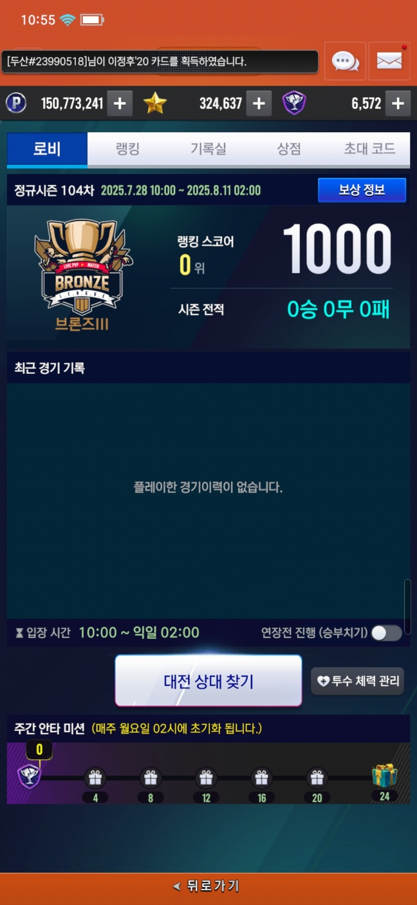
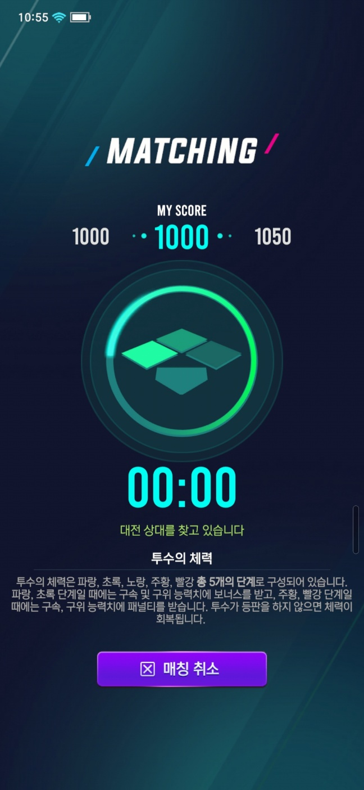
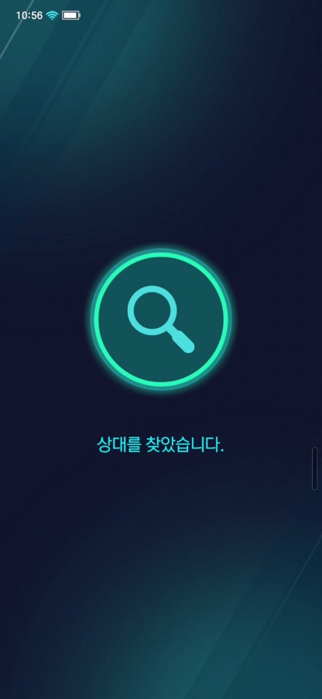
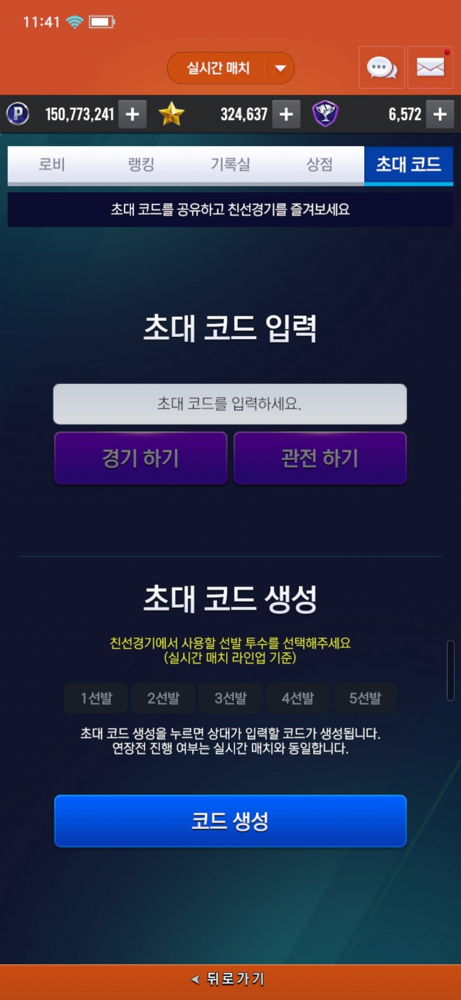
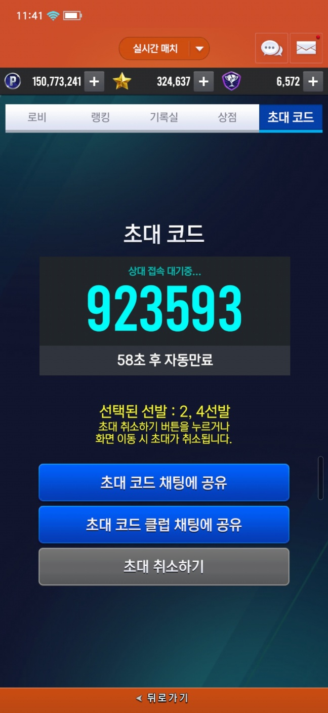

소켓 통신에 관한 자세한 내용은 [이 문서](https://aszd0708.github.io/V25_Socket)를 참고 바랍니다.

## PvP 매칭(실시간 매칭, 클럽 매칭 동일한 구조)

<iframe width="560" height="315" src="https://www.youtube.com/watch?v=9d24yzq-zxM&t=59s" title="YouTube video player" frameborder="0" allow="accelerometer; autoplay; clipboard-write; encrypted-media; gyroscope; picture-in-picture" allowfullscreen></iframe>

(PvP 로비 화면)

- 이 상황에 기존에 진행하던 매칭이 있다면

    인게임 진입 팝업 오픈 

- 만약, 게임을 다시 실행 했을 시, 기존에 진행하던 게임 정보가 있다면

    인게임 진입 팝업 오픈

(PvP 매칭 화면)

매칭 시작 패킷 전송 -> 상대 매칭까지 기다립니다. -> 만약 취소를 눌렀다면, 취소 패킷을 보냅니다.

각 패킷마다 Notification으로 정의된 패킷을 받는다면 그에 따른 명령을 실행합니다..

(PvP 매칭 성공 화면)

만약 정상적으로 상대 정보에 관한 패킷을 받았다면, 매칭 후 인게임으로 진입합니다.

## 코드 매칭
(PvP 코드 생성)

선발 선택 후 코드생성을 누르면 서버에게 패킷 전송 후 Notification을 기다립니다.

초대코드 입력 후 경기 및 관전을 하게 되면, 그 코드에 있는 게임으로 이동합니다.

(PvP 코드 로비)

생성 후 채팅 공유 및 상대를 기다립니다

## 재접속
소켓 서버의 Logon 패킷에서 아직 진행중인 경기가 있다면, 경기를 재진행을 위한 팝업을 띄워줍니다. 확인을 누른다면 재진입을 하지만, 취소를 누른다면, 서버에 기권 패킷을 보냅니다.

하지만, 이전 경기가 정상적으로 종료가 됐다면, 이전 경기 결과를 팝업으로 보여줍니다.