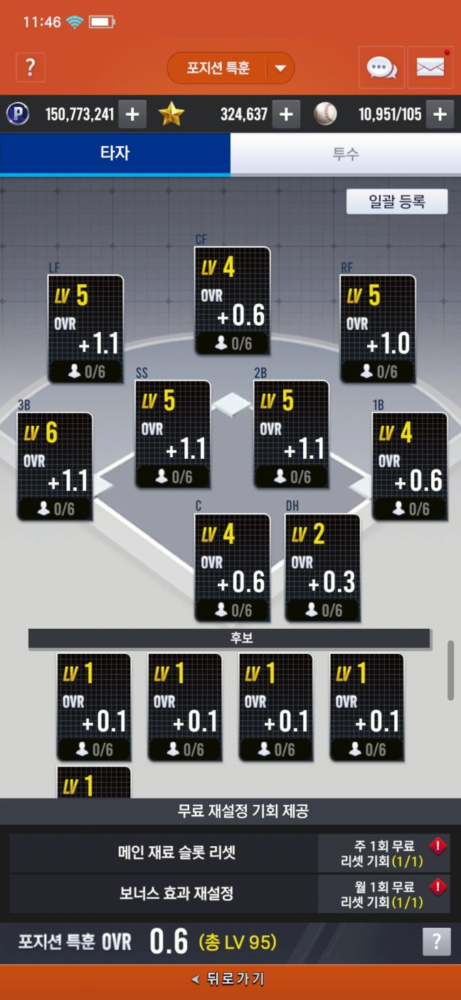
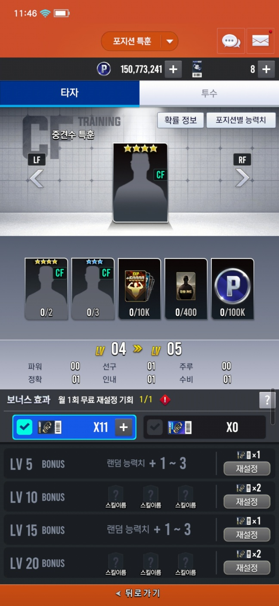
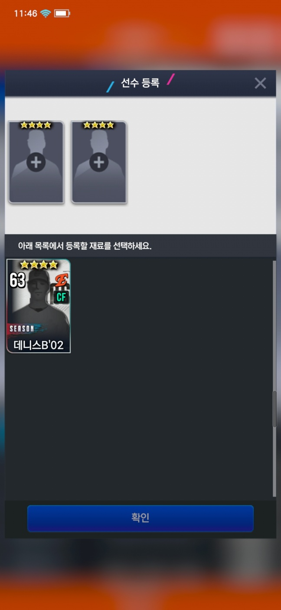
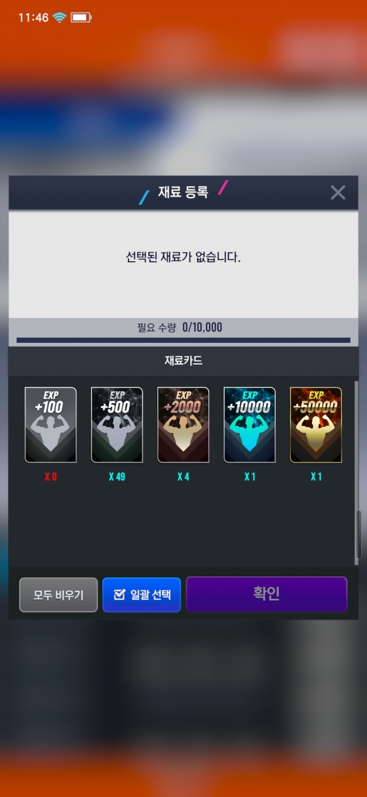
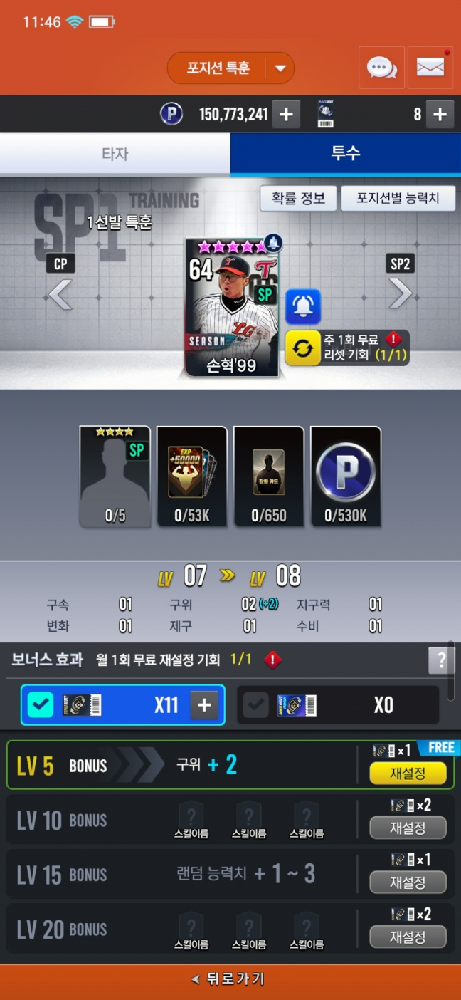
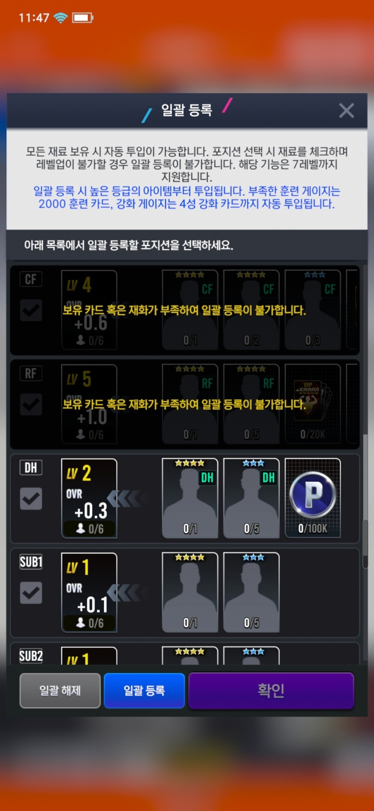

## 포지션 특훈

특정 포지션들에 스탯을 부여 할수 있습니다.

재료를 넣어 레벨업을 해, 스탯이 올라갑니다.

원하는 포지션을 선택합니다.

선수 카드 및 강과, 훈련 카드를 넣을수 있게 되어 있습니다.

두개 이상 선수 카드를 넣을경우 다음과 같은 팝업이 뜨고,

재료 카드를 넣을 경우 위와 같은 팝업이 뜨게 됩니다.

그리고 모든 재료를 넣었을 경우

연출이 나오고 스탯이 반영 됩니다.

5,10,15,20레벨일 경우에 스킬 및 스탯 보너스가 추가됩니다.

특정 레벨 이후에는 필요한 특정한 카드가 생깁니다.

특정한 카드가 인벤토리에 있는 경우 포지션특훈에 레드닷이 생기며, 해당 카드에는 특정한 카드에만 표시되는 알림 티커가 추가됩니다.

특정한 카드가 없을때 까지 현재 소지하고 있는 아이템들을 검사하여 자동으로 넣을수 있게 합니다.

포지션 Index가 가장 낮은 값부터 순서대로 넣게 됩니다.

특정한 카드를 넣는 기능도 만들어 놨지만, 기획 단계에서 제외됐습니다.