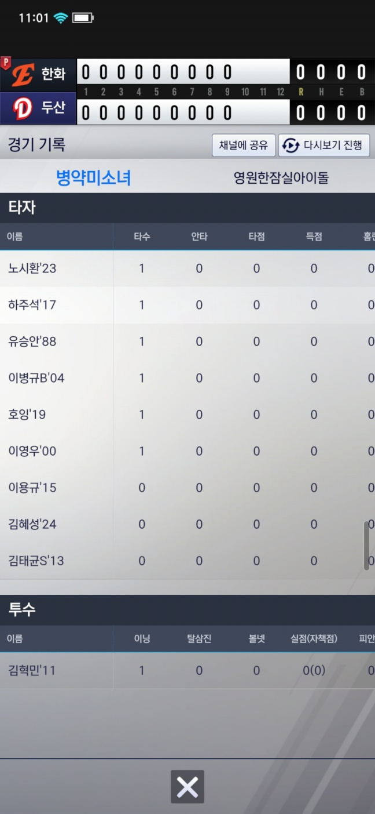
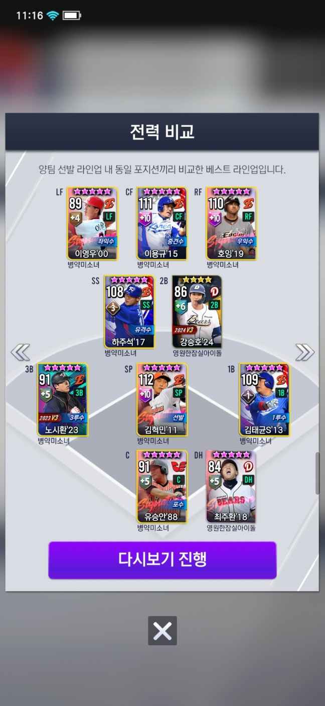
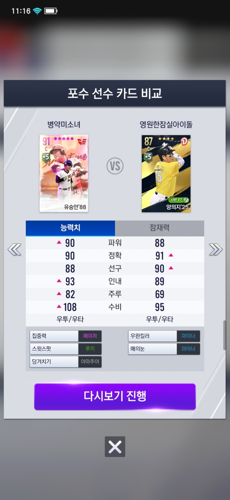

## 경기 결과
기존의 인게임에서는 프로토콜 버퍼가 아닌 바이트 파싱을 사용하기 때문에 다른 방식을 사용합니다.

(PvP 경기 결과)

- 기록을 확인 하면, 해당 매치에서 사용한 모든 인게임 패킷 데이터에 관한 바이트 파일을 서버로 부터 받게 됩니다.
- 해당 바이트 파일에서 경기 기록에 관한 패킷ID만 우선적으로 필터링을 합니다.
    - 해당 바이트 들은 혹시 경기마다 다를수도 있으니, HashSet을 이용하여 모드마다 필요한 패킷ID를 우선적으로 정의 합니다.
- 필터링 된 바이트들을 파싱을 하여, 경기 기록 및 라인업을 만들게 됩니다.
    - 인게임의 바이트는 [아웃게임의 소켓 통신의 바이트](https://aszd0708.github.io/V25_Socket)와 비슷하지만, Body부분이 프로토콜 버퍼가 아닌 바이트이기 때문에 (크기, 바이트) 이 순으로 파싱을 합니다.
- 위에 과정중 에러가 발생하면, 정상적으로 진행된 경기가 아니라고 판단하여, 에러 팝업을 띄워줍니다.

(PvP 다시보기)

다시보기 진행 버튼을 눌렀을 경우, 파싱한 데이터들을 갖고와 자신의 선수와 상대의 라인업 비교를 진행합니다.

다시보기 클릭시, 현재 파싱했던 바이트들을 인게임으로 전달을 하고, 인게임의 리플레이 모드로 이동합니다.