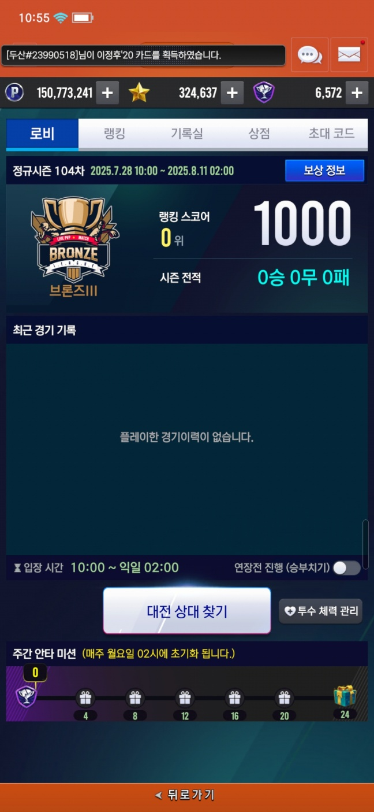
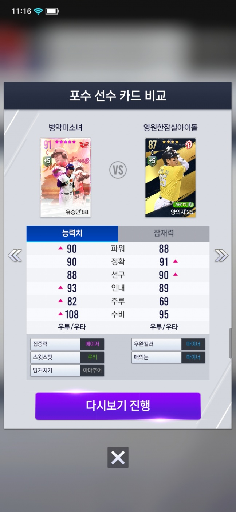
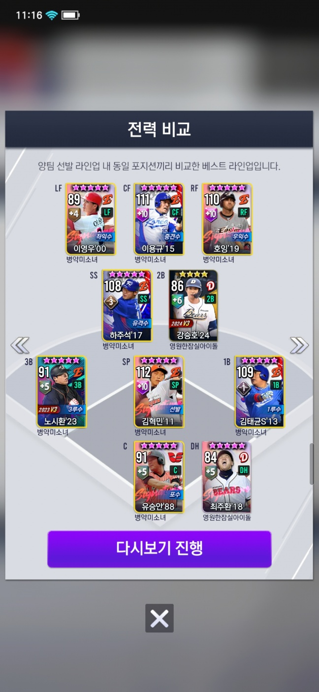

기본적으로는 C#의 Socket을 사용해서 서버를 연결

그 후 통신은 서버와 양식에 맞게 바이트를 잘라서 사용
정보가 담겨있는 바이트는 [Protocal Buffer](https://protobuf.dev/getting-started/csharptutorial/)를 사용 (특정 한곳 에서만 바이트 파싱을 사용)

(PvP 로비 화면)

- 이 상황에 기존에 진행하던 매칭이 있다면

    인게임 진입 팝업 오픈 

- 만약, 게임을 다시 실행 했을 시, 기존에 진행하던 게임 정보가 있다면

    인게임 진입 팝업 오픈

(PvP 매칭 화면)

매칭 시작 패킷 전송 -> 상대 매칭까지 기다림 -> 만약 취소를 눌렀다면, 취소 패킷을 보냄

각 패킷마다 Notification으로 정의된 패킷을 받는다면 그에 따른 명령을 실행.

(PvP 매칭 성공 화면)

만약 정상적으로 상대 정보에 관한 패킷을 받았다면, 매칭 후 인게임으로 진입.

(PvP 경기 결과)

기존의 인게임에서는 프로토콜 버퍼가 아닌 바이트 파싱을 사용하기 때문에 다른 방식을 사용

서버로 부터 게임동안 진행됐던 패킷들을 전부 받아, 그 중에 경기 기록에 관한 패킷들만 파싱

(PvP 다시보기)

다시보기 진행 버튼 터치시 유저 라인업 부분을 파싱 후 출력