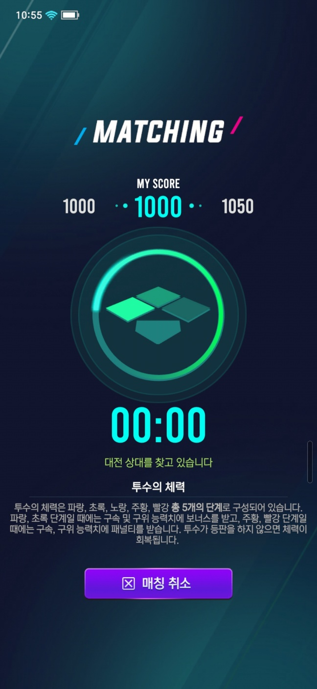
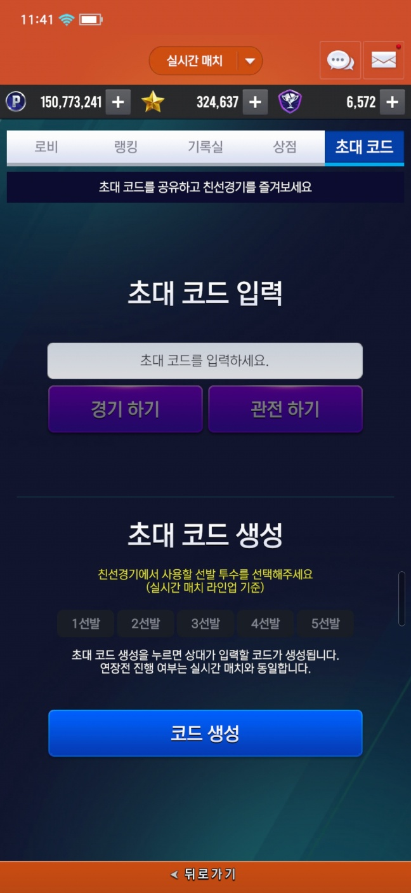
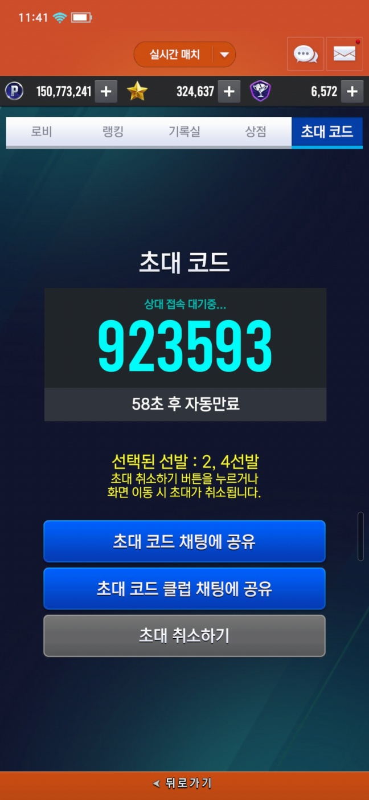

기본적으로는 C#의 Socket을 사용해서 서버를 연결합니다.

패킷은 Sequence, PacketID, Body 이렇게 나눠져 있으며 바이트를 잘라서 사용합니다.

Sequence와 PacketID를 자르고 난 뒤, Body 부분은 [Protocal Buffer](https://protobuf.dev/getting-started/csharptutorial/)를 사용합니다. 

## 기본 구조
1. 클라이언트에서 요청 패킷을 보냅니다.
2. 서버에서는 받았다는 응답 패킷을 보냅니다
3. 서버에서 필요할때 Notification을 보내고 클라이언트는 해당 Notification에 맞는 명령을 실행합니다.

- 소켓 연결
    - 소켓은 5초에 한번씩 핑을 보냅니다
    - 5초에 한번씩 연결을 검사 합니다.
        - 만약, 연결이 끊겨있을 경우 5초->10초->15초...->60초->60초 에 한번씩 연결을 시도합니다..
    - 서버에서 특정한 에러를 받았을 경우 연결을 끊거나, 게임 로비로 돌아갑니다..

## PvP 매칭(실시간 매칭, 클럽 매칭 동일한 구조)

<iframe width="560" height="315" src="https://www.youtube.com/watch?v=9d24yzq-zxM&t=59s" title="YouTube video player" frameborder="0" allow="accelerometer; autoplay; clipboard-write; encrypted-media; gyroscope; picture-in-picture" allowfullscreen></iframe>

(PvP 로비 화면)

- 이 상황에 기존에 진행하던 매칭이 있다면

    인게임 진입 팝업 오픈 

- 만약, 게임을 다시 실행 했을 시, 기존에 진행하던 게임 정보가 있다면

    인게임 진입 팝업 오픈

(PvP 매칭 화면)

매칭 시작 패킷 전송 -> 상대 매칭까지 기다립니다. -> 만약 취소를 눌렀다면, 취소 패킷을 보냅니다.

각 패킷마다 Notification으로 정의된 패킷을 받는다면 그에 따른 명령을 실행합니다..

(PvP 매칭 성공 화면)

만약 정상적으로 상대 정보에 관한 패킷을 받았다면, 매칭 후 인게임으로 진입합니다.

## 코드 매칭
(PvP 코드 생성)

선발 선택 후 코드생성을 누르면 서버에게 패킷 전송 후 Notification을 기다립니다.

초대코드 입력 후 경기 및 관전을 하게 되면, 그 코드에 있는 게임으로 이동합니다.

(PvP 코드 로비)

생성 후 채팅 공유 및 상대를 기다립니다

## 경기 결과

(PvP 경기 결과)

기존의 인게임에서는 프로토콜 버퍼가 아닌 바이트 파싱을 사용하기 때문에 다른 방식을 사용합니다.

서버로 부터 게임동안 진행됐던 패킷들을 전부 받아, 그 중에 경기 기록에 관한 패킷들을 필터링을 합니다.

그 후, 필요한 패킷들만 골라 각 선수의 데이터마다 스탯, 이름 등등 바이트로 나눠서 아웃게임에서 사용중인 클래스로 제작 합니다.

(PvP 다시보기)

다시보기 진행 버튼 터치시 유저 라인업 부분을 파싱 후 출력합니다.