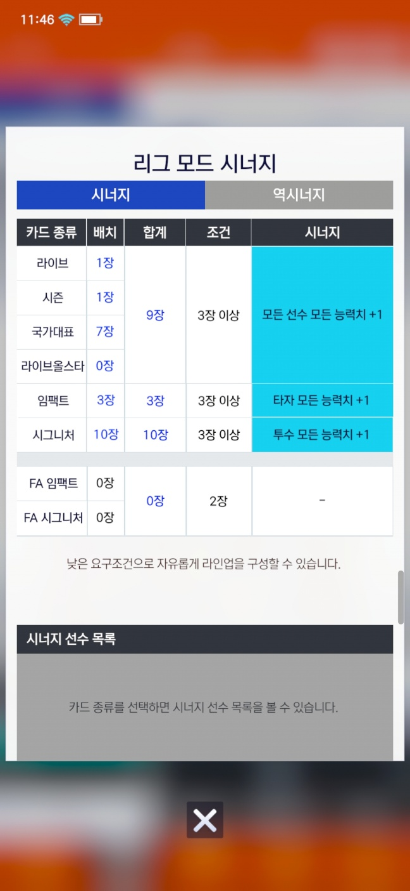
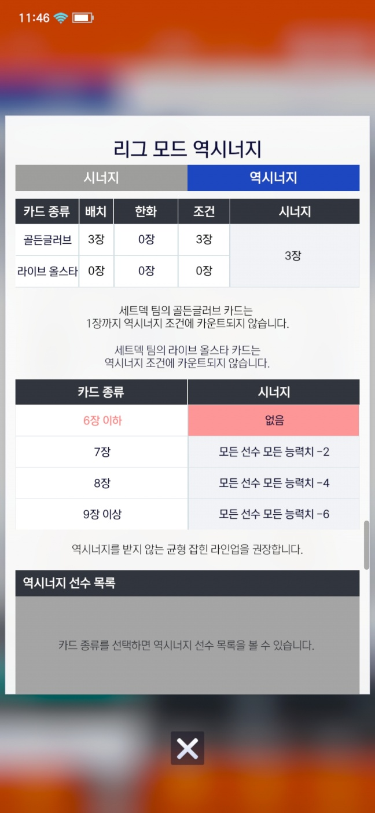

## 시너지
V25에서는 많은 등급의 카드가 존재

1. 시즌
2. 라이브
3. 임펙트
4. 올스타
5. 국가대표
6. 시그니처
7. 골든글러브

번호가 높을수록 얻기 힘들지만, 성능이 그만큼 보장됩니다.

이로 인해, 상위 티어로 가면 갈수록 모든 등급의 카드가 아닌, 국가대표, 시그니처, 골든글러브 카드만 사용 합니다.

이를 해결하기 위해 각 등급별 카드를 사용하는 갯수에 때라 시너지 스탯 및 역시너지 스탯을 부여 합니다.

시너지

역시너지

라인업 구성을 하거나, 상대 라인업을 불러올떄 마다, 각 라인업의 선수 카드를 갖고와 라인업에 각 스탯을 추가 해줍니다.