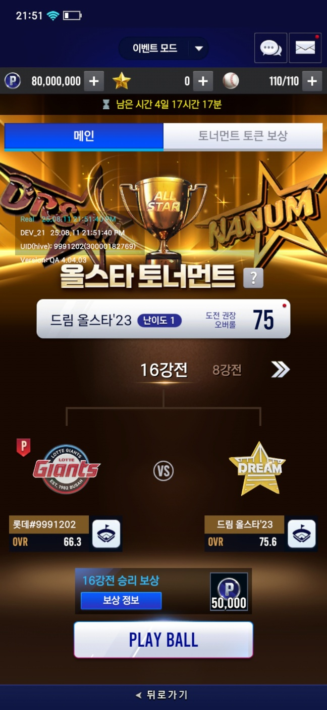
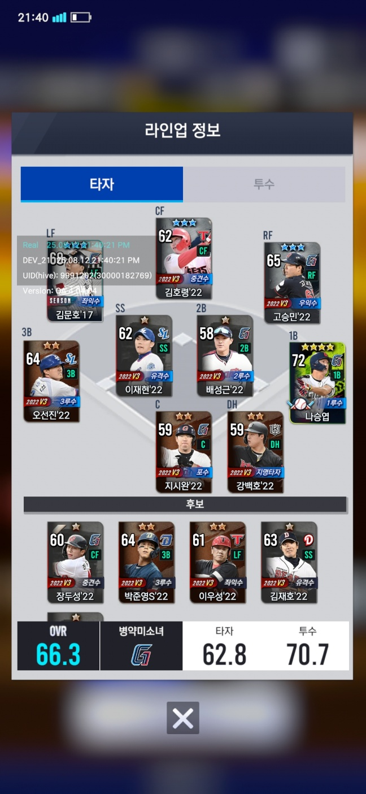
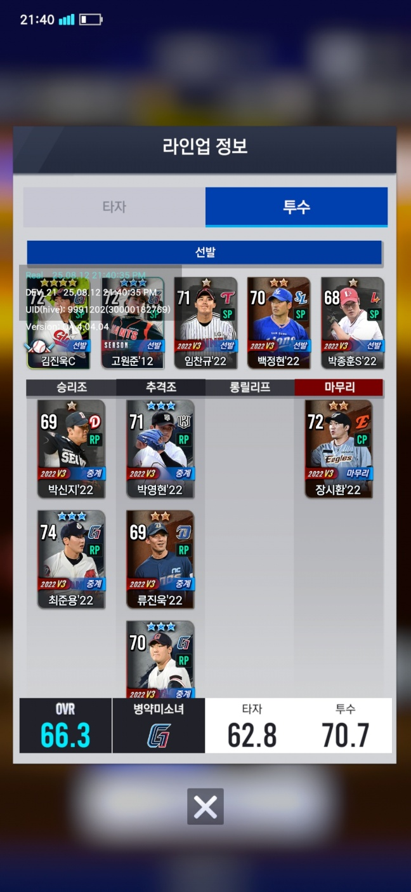
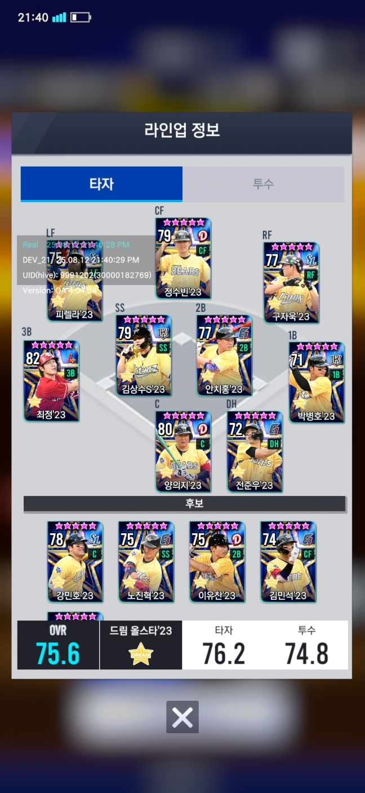
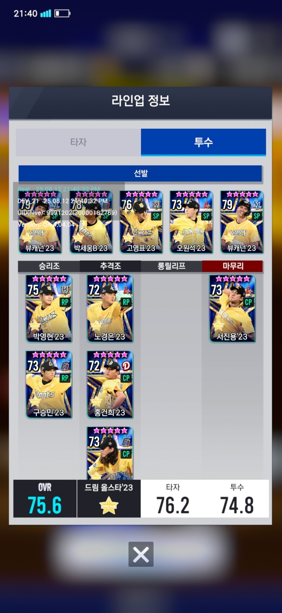
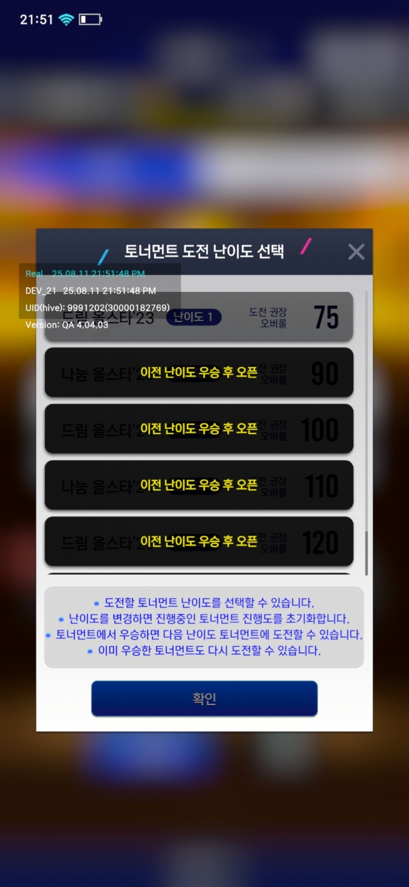
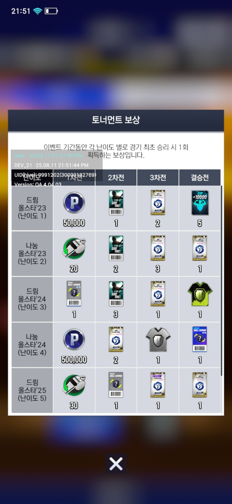
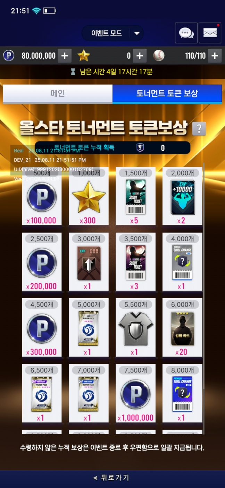

해당 모드는 시즌마다 다른 테마로 진행을 하며, 그로 인해 하나의 메인 프리팹에서 이벤트 정보에 따라 프리팹을 로드를 하는 구조를 사용하고 있습니다.

## 메인

게임 모드에 진입 시, 현재 할수 있는 경기 (4강전이면 4강전으로) 진입을 합니다.

PlayBall을 누를 경우 인게임으로 진입을 합니다.

자신의 구단의 정보를 확인하면, 이렇게 현재 오버롤과 라인업을 확인할 수 있으며,

상대의 라인업을 누를 경우 상대의 오버롤 및 라인업을 확인할 수 있습니다.

가운데 난이도 버튼을 누르게 되면, 현재 선택할 수 있는 난이도를 선택할 수 있습니다.

하단의 보상 정보를 누르면, 플레이를 하면서 얻을 수 있는 보상들을 기획데이터를 참조해서 보여줍니다.

## 보상

게임을 진행하면서 얻은 토큰의 갯수에 따라 보상을 얻을 수 있습니다.