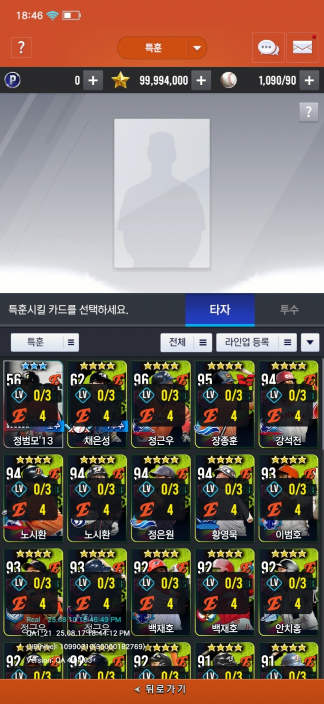
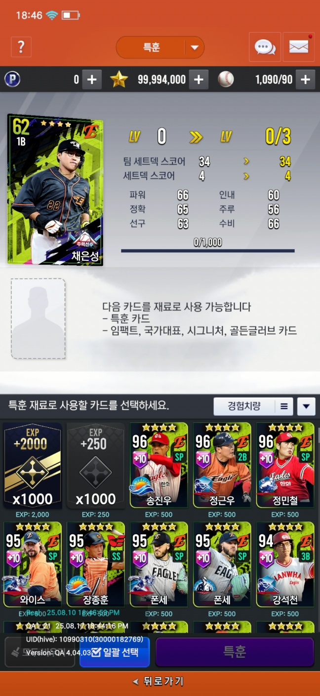

<iframe width="560" height="315" src="https://www.youtube.com/watch?v=ekf2nrWJGWA&t=146s" title="YouTube video player" frameborder="0" allow="accelerometer; autoplay; clipboard-write; encrypted-media; gyroscope; picture-in-picture" allowfullscreen></iframe>

## 특훈

게임 스탯 + 1 과 세트덱 포인트 + 1 을 하게 하는 육성 방법 입니다.

먼저 올리고 싶은 카드를 선택합니다. 카드는 현재 인벤토리 및 라인업에 있는 카드 입니다. 각 카드마다 특훈 레벨과 현재 세트덱 팀, 세트덱 포인트를 출력합니다.

선택을 하면, 현재 갖고있는 아이템 및 선수 카드들이 출력되며, 각 카드를 터치하면 실시간으로 경험치 및 올라가는 레벨을 확인할수 있습니다.

레벨을 올리려고 하면, 원하는 스탯을 선택한 후, 연출이 나오게 됩니다.

