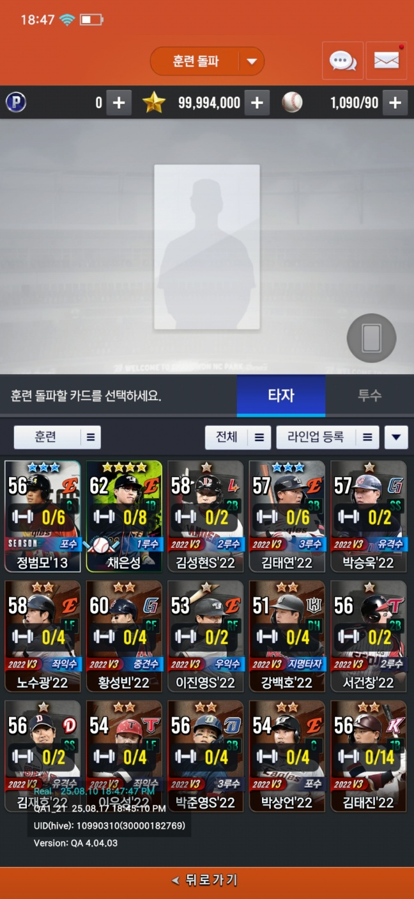
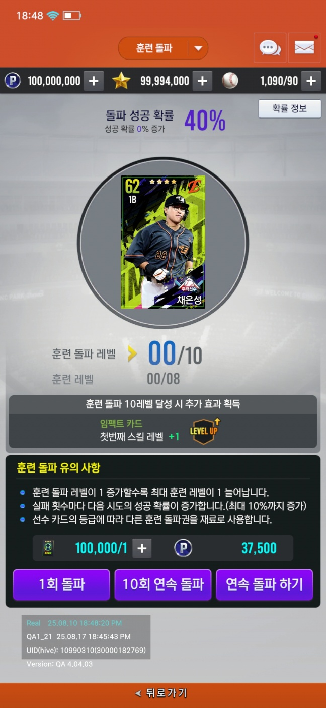
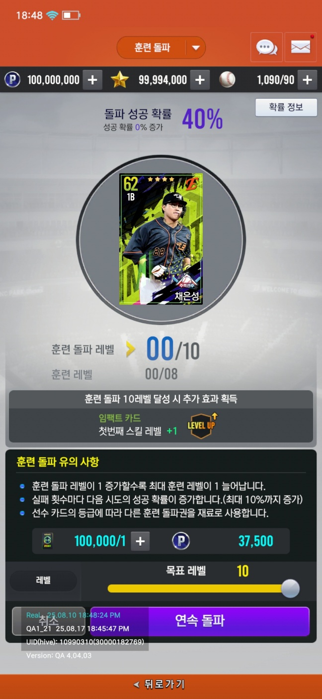

## 훈련돌파

훈련 MAX 레벨을 올릴수 있는 성장 방법

먼저 올리고 싶은 카드를 선택합니다. 카드는 현재 인벤토리 및 라인업에 있는 카드 입니다. 각 카드마다 현재 훈련 레벨 및 MAX 레벨을 출력합니다.

선수를 선택하면, 현재 레벨과 소지아이템/필요한 아이템 및 포인트를 출력합니다.

10회 연속 돌파 버튼은 현재 아이템 및 포인트를 계산해서 1~10회까지 할수있게 합니다. (3회만 가능하면 3회 연속 돌파) 만약 1레벨이라도 올랐을 경우에는 더이상 하지 않고 연출만 출력합니다.

연속돌파 하기 버튼은 원하는 레벨을 설정하고 레벨업을 합니다. 해당 레벨을 달성 하거나, 아이템의 소지 갯수에 따라 자동으로 정지 합니다.

연출을 표기하고 종료 합니다.