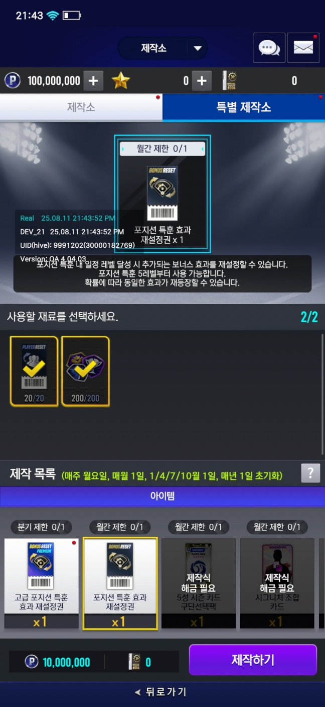

제작소는 일반 제작소와 특별 제작소로 나눠진다.

## 제작소
제작 카드 (1~5성 제작카드)와 라이브or시즌 카드를 소모하여 아이템을 제작 할수 있습니다.

아이템은 기획데이터를 참조해서 각탭에 아이템을 보내고, 각 아이템에서 필요한 값들을 갖고온다.

이렇게 네개의 타입이 있습니다.

- 카드를 하나의 종류만 넣는 타입
- 카드를 두개의 종류만 넣는 타입
- 카드 및 아이템을 성급 합으로 넣는 타입
- 각 성급 아이템을 각각 강화 아이템이나 제작카드로 변환되는 타입

아이템 팝업은 각 성급에 따른 아이템과 성급의 카드가 출력됩니다.

아이템을 넣었을 때는 이런식으로 아이템이 나오게 되고 제작하기를 누르면

연출이 출력 됩니다. 연출을터치 했을때는 바로 결과화면으로 스킵 됩니다.

## 특별제작소

조금 더 좋은 아이템을 제작할수 있지만, 많은 아이템과 재화가 소모됩니다.

처음 진입시 이런 조건이 있으며, 해당 조건을 달성하면,

아이템마다 세부 조건이 추가 됩니다.

이 조건은 업적 데이터에서 갖고옵니다.

조건 달성시 제작이 열리게 되며, 이 제작 아이템은 각각 기획데이터에서 재료를 참조하고 출력합니다.

재료들에 대한건 이 문서를 참고 [참고](https://aszd0708.github.io/V25_CardMaterial/)

다 넣었을 경우 제작하기 버튼이 활성화가 되며

제작소와 마찬가지로 연출이 출력됩니다.