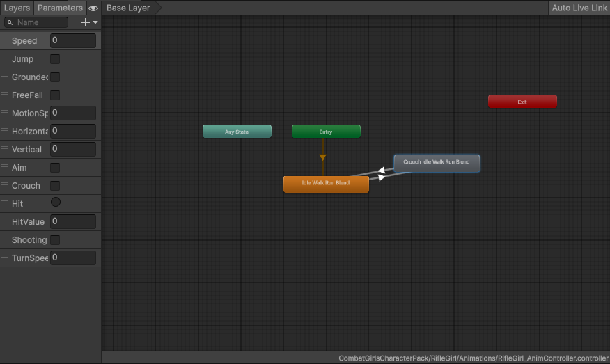
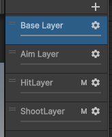
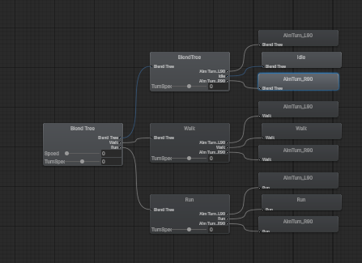
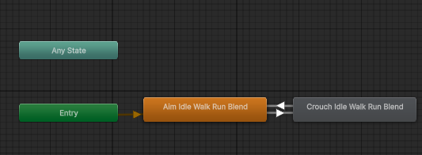

유니티 에셋을 찾아보다가 모델링이 마음에 드는 에셋을 발견해서 한번 만들어보기로 한다.
늘 이럴때 문제가 되는게 필요한 애니메이션이나 다른것들이 없는 것이다.
일단, 있긴 있으니까 있는걸로 만들어보자

이건 삿건
https://assetstore.unity.com/packages/3d/characters/humanoids/humans/combatgirls-shotguncharacterpack-308250

이건 소총
https://assetstore.unity.com/packages/3d/characters/humanoids/humans/combatgirls-riflecharacterpack-305180

일단, 있는걸로 어떻게 만들어 보자
일단, 유니티 내에서 지원해주는 ThirdPersonController를 사용해서 약간 변형해서 만들어준다.

이동하는 쪽을 조금 수정 해서 조준하는 동안 캐릭터가 카메라만 바라보게 해주자, 그리고 기존에 움직임은 바로 캐릭터가 턴을 하지만, 러프하게 수정 하자


<details>
<summary style="color:green">Move</summary>
<div markdown="1">

```
private void Move()
{
    // set target speed based on move speed, sprint speed and if sprint is pressed
    float targetSpeed = GetTargetSpeed();

    // a simplistic acceleration and deceleration designed to be easy to remove, replace, or iterate upon

    // note: Vector2's == operator uses approximation so is not floating point error prone, and is cheaper than magnitude
    // if there is no input, set the target speed to 0
    if (_input._move == Vector2.zero) targetSpeed = 0.0f;

    // a reference to the players current horizontal velocity
    float currentHorizontalSpeed = new Vector3(_controller.velocity.x, 0.0f, _controller.velocity.z).magnitude;

    float speedOffset = 0.1f;
    float inputMagnitude = _input.analogMovement ? _input._move.magnitude : 1f;

    // accelerate or decelerate to target speed
    if (currentHorizontalSpeed < targetSpeed - speedOffset)
    {
        // creates curved result rather than a linear one giving a more organic speed change
        // note T in Lerp is clamped, so we don't need to clamp our speed
        _speed = Mathf.Lerp(currentHorizontalSpeed, targetSpeed * inputMagnitude, Time.deltaTime * SpeedChangeRate);

        // round speed to 3 decimal places
        _speed = Mathf.Round(_speed * 1000f) / 1000f;
    }
    else if(currentHorizontalSpeed > targetSpeed + speedOffset)
    {
        _speed = Mathf.Lerp(currentHorizontalSpeed, targetSpeed * inputMagnitude, Time.deltaTime * SpeedChangeRate * SpeedChangeRate);
        _speed = Mathf.Round(_speed * 1000f) / 1000f;
    }
    else
    {
        _speed = targetSpeed;
    }

    _animationBlend = Mathf.Lerp(_animationBlend, targetSpeed, Time.deltaTime * SpeedChangeRate);
    if (_animationBlend < 0.01f) _animationBlend = 0f;

    // normalise input direction
    Vector3 inputDirection = new Vector3(_input._move.x, 0.0f, _input._move.y).normalized;

    // note: Vector2's != operator uses approximation so is not floating point error prone, and is cheaper than magnitude
    // if there is a move input rotate player when the player is moving
    float turnAnimationBlend = 0;
    Vector3 targetDirection = Quaternion.Euler(0.0f, _targetRotation, 0.0f) * Vector3.forward;
    if (_input._move != Vector2.zero)
    {
        _targetRotation = Mathf.Atan2(inputDirection.x, inputDirection.z) * Mathf.Rad2Deg +
                          _mainCamera.transform.eulerAngles.y;
        float rotation = Mathf.SmoothDampAngle(transform.eulerAngles.y, _targetRotation, ref _rotationVelocity,
            RotationSmoothTime);

        if (_input.Aim == false || _input.Crouch)
        {
            transform.rotation = Quaternion.Euler(0.0f, rotation, 0.0f);
        }

        targetDirection = Quaternion.Euler(0.0f, rotation, 0.0f) * Vector3.forward;

        float angleDifference = Mathf.DeltaAngle(transform.eulerAngles.y, _targetRotation);
        turnAnimationBlend = Mathf.Lerp(turnAnimationBlend, angleDifference / 90f, Time.deltaTime * 5f);
    }
    else
    {
        turnAnimationBlend = Mathf.Lerp(turnAnimationBlend, 0f, Time.deltaTime * 5f);
    }
    if(_input.Aim == true)
    {
        targetDirection = Quaternion.Euler(0.0f, _targetRotation, 0.0f) * Vector3.forward;
    }
    // move the player
    _controller.Move(targetDirection.normalized * (_speed * Time.deltaTime) + new Vector3(0.0f, _verticalVelocity, 0.0f) * Time.deltaTime);

    // update animator if using character
    if (_hasAnimator)
    {
        _animator.SetFloat(_animIDSpeed, _animationBlend);
        _animator.SetFloat(_animIDMotionSpeed, inputMagnitude);
        horizontal = Mathf.Lerp(horizontal, _input._move.y, Time.deltaTime * AimRotationSmoothTime);
        _animator.SetFloat(_animIDHorizontal, horizontal);
        vertical = Mathf.Lerp(vertical, _input._move.x, Time.deltaTime * AimRotationSmoothTime);
        _animator.SetFloat(_animIDVertical, vertical);
        _animator.SetFloat("TurnSpeed", turnAnimationBlend);
    }
}
```
</div>
</details>

그리고 각 무기마다, 값을 편하게 수정하기 위해 Scriptable Objects로 만들어주자

<details>
<summary style="color:green">WeaponInfo</summary>
<div markdown="1">

```
using UnityEngine;

[CreateAssetMenu(fileName = "WeaponInfo", menuName = "Scriptable Objects/WeaponInfo")]
public class WeaponInfo : ScriptableObject
{
    public float _bulletSpeed;
    public float _bulletDistance = Mathf.Infinity;
    public float _coolTime;
    public int _maxBullet;

    [Space(10)]
    [Header("탄착군")]
    public Vector2 _bulletImpactMin;
    public Vector2 _bulletImpactMax;

    [Space(10)]
    [Header("한번에 발포될 총의 갯수")]
    public int _firingBulletCount;

    [Space(10)]
    [Header("반동")]
    public Vector2 _recoilVector;
    public Vector2 _recoilPowerMin;
    public Vector2 _recoilPowerMax;
}
```
</div>
</details>

이렇게 하고, 각 애니메이션 연결 해주고 그에 맞게 애니메이션을 재생 하게 한다.
(조준하면 조준 하고, 쏘면 쏘고, 맞으면 맞고, 앉으면 앉고 등등)

<details>
<summary style="color:green">WeaponInfo</summary>
<div markdown="1">

```
using AYellowpaper.SerializedCollections;
using Cinemachine;
using StarterAssets;
using System.Collections.Generic;
using UnityEditor.Animations;
using UnityEngine;

public class PlayerManager : MonoBehaviour
{    public enum eWeapon
    {
        Rifle = 0,
        Shotgun = 1,
        //Sniper = 3,
        MAX,
    }

    [System.Serializable]
    public struct sWeaponInfo
    {
        public GameObject _weaponObj;
        public PlayerWeapon _weapon;
        public Animator _animatorController;
    }

    private PlayerInputSystemManager _input;
    private ThirdPersonController _controller;
    private Animator _anim;

    [Header("캐릭터들")]
    [SerializeField]
    private eWeapon _currentWeapon  = eWeapon.Rifle;
    [SerializeField]
    [SerializedDictionary("Weapon Type", "Info")]
    private SerializedDictionary<eWeapon, sWeaponInfo> _weaponDic;

    [SerializeField]
    private PlayerWeapon SelectedWeapon => _weaponDic[_currentWeapon]._weapon;

    [Header("Aim")]
    [SerializeField]
    private CinemachineVirtualCamera _aimCam;
    [SerializeField]
    private LayerMask _targetLayer;
    [SerializeField]
    private GameObject _aimObj;
    [SerializeField]
    private float _aimObjDistance = 10.0f;

    [SerializeField]
    private float _aimWeightChangeSpeed = 1.0f;
    private float _aimWeight = 0;

    private int _animationAimID;
    private int _animationCrouchID;
    private int _hitTriggerID;
    private int _hitValueID;
    private int _shootingID;

    private void Awake()
    {
        if (_input == null)
        {
            _input = GetComponent<PlayerInputSystemManager>();
        }

        if (_controller == null)
        {
            _controller = GetComponent<ThirdPersonController>();
        }

        if (_anim == null)
        {
            _anim = GetComponent<Animator>();
        }
    }

    private void Start()
    {
        _input.FirstGunCallBack += () =>
        {
            ChangeWeapon(_currentWeapon, eWeapon.Rifle);
        };

        _input.SecondGunCallBack += () =>
        {
            ChangeWeapon(_currentWeapon, eWeapon.Shotgun);
        };

        InitWeapons();

        SetAnimationIDs();
        ChangeWeapon(eWeapon.MAX, _currentWeapon);
    }

    private void InitWeapons()
    {
        for(int i = (int)eWeapon.Rifle; i < (int)eWeapon.MAX; ++i)
        {
            eWeapon weapon = (eWeapon)i;
            sWeaponInfo info = _weaponDic[weapon];
            info._weaponObj.SetActive(false);
        }
    }

    private void Update()
    {
        CheckAim();
        CheckCrouch();

        if(Input.GetKeyDown(KeyCode.L))
        {
            StartHit();
        }
    }

    private void ChangeWeapon(eWeapon prevWeapon, eWeapon nextWeapon)
    {
        if (prevWeapon == nextWeapon) return;

        if(_weaponDic.ContainsKey(prevWeapon))
        {
            sWeaponInfo prevWeaponInfo = _weaponDic[prevWeapon];
            prevWeaponInfo._weaponObj.SetActive(false);
        }
        if (_weaponDic.ContainsKey(nextWeapon))
        {
            sWeaponInfo nextWeaponInfo = _weaponDic[nextWeapon];
            nextWeaponInfo._weaponObj.SetActive(true);
            _anim = nextWeaponInfo._animatorController;
            _currentWeapon = nextWeapon;
        }
        SetAnimationIDs();
    }

    private void SetAnimationIDs()
    {
        _animationAimID = Animator.StringToHash("Aim");
        _animationCrouchID = Animator.StringToHash("Crouch");
        _hitTriggerID = Animator.StringToHash("Hit");
        _hitValueID = Animator.StringToHash("HitValue");
        _shootingID = Animator.StringToHash("Shooting");
    }

    private void StartHit()
    {
        _anim.SetLayerWeight(2, 0.5f);
        _anim.SetTrigger(_hitTriggerID);
        float randomValue = Random.Range(0.0f, 1.0f);
        _anim.SetFloat(_hitValueID, randomValue);
        _controller.IsHitting = true;
    }

    private void EndHit()
    {
        _anim.SetLayerWeight(2, 0);
        _controller.IsHitting = false;
    }

    private bool IsAiming()
    {
        return (_input.Aim == true && _input.Crouch == false) ||
            (_input.Aim == true && (_input._move == Vector2.zero) && _input.Crouch);
    }

    private void CheckAim()
    {
        AimControll(_input.Aim);
        if (IsAiming())
        {
            Vector3 targetPosition = Vector3.zero;
            Transform camTransform = Camera.main.transform;
            RaycastHit hit;
        
            if (Physics.Raycast(camTransform.position, camTransform.forward, out hit, Mathf.Infinity, _targetLayer))
            {
                targetPosition = hit.point;
                _aimObj.transform.position = targetPosition;
            }
            else
            {
                targetPosition = camTransform.position + camTransform.forward * _aimObjDistance;
                _aimObj.transform.position = camTransform.position + camTransform.forward * _aimObjDistance;
            }
        
            Vector3 targetAim = targetPosition;
            targetAim.y = transform.position.y;
            Vector3 aimDir = (targetAim - transform.position).normalized;
        
            transform.forward = Vector3.Lerp(transform.forward, aimDir, Time.deltaTime * 10.0f);

            _aimWeight += Time.deltaTime * _aimWeightChangeSpeed;
            if (_aimWeight > 1)
            {
                _aimWeight = 1;
            }

            if(_input.Shoot)
            {
                SelectedWeapon.Shoot();
                _anim.SetLayerWeight(3, 1);
            }
            else
            {
                _anim.SetLayerWeight(3, 0);
            }
            _anim.SetBool(_shootingID, _input.Shoot);
        }
        else
        {
            _anim.SetLayerWeight(1, 0);
            _aimWeight -= Time.deltaTime * _aimWeightChangeSpeed;
            if(_aimWeight < 0)
            {
                _aimWeight = 0;
            }
        }
        _anim.SetLayerWeight(1, _aimWeight);
    }

    private void AimControll(bool isCheck)
    {
        _aimCam.gameObject.SetActive(isCheck);
        _anim.SetBool(_animationAimID, isCheck);
    }

    private void CheckCrouch()
    {
        bool isCheck = _input.Crouch;
        _anim.SetBool(_animationCrouchID, isCheck);
    }
}
```
</div>
</details>

이렇게 하고 애니메이터에 각 애니메이션을 연결 하자





에임도 Move와 비슷하게 만들어준다.



이렇게 하고 1번일때, 소총, 2번을 누르면 산탄총을 나오게 수정을 하고 그에 따라 변경되는 로직을 넣으면, (위에 코드에 있다)


약간 문제가 있었던걸 빼면 그럭저럭 나온다.

다음엔 총이다.