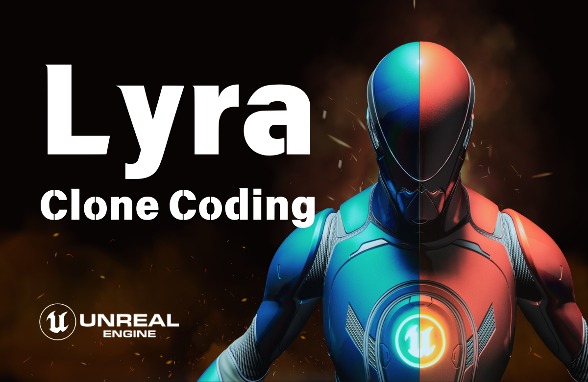

[Lyra](https://dev.epicgames.com/documentation/ko-kr/unreal-engine/lyra-sample-game-in-unreal-engine)

[GIT](https://github.com/aszd0708/UE5_LyraStudy)

언리얼 엔진의 Lyra 프로젝트의 구성을 공부하고 똑같이 만드는 프로젝트 입니다.